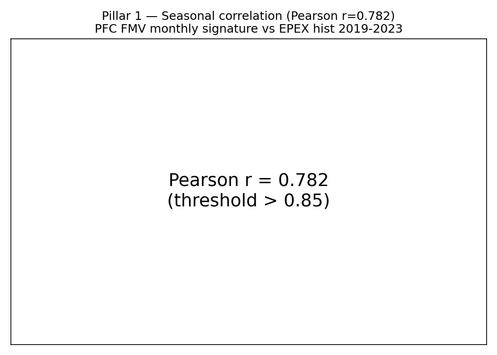
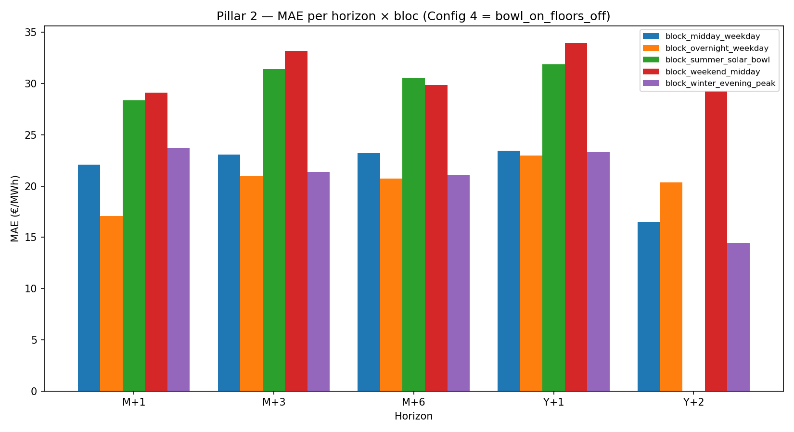
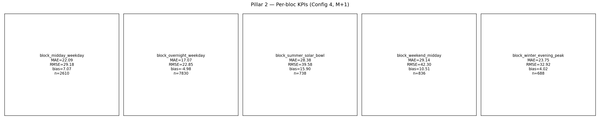
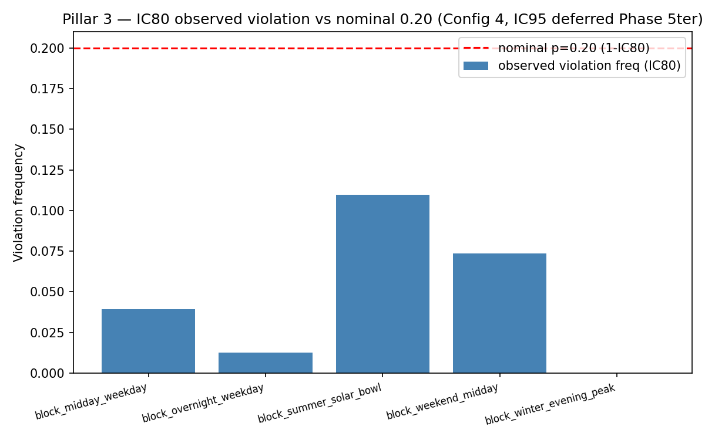

# Phase 10 — PFC FMV Quality Scorecard (5-pillar SOTA replication)

**Generated** : 2026-05-21T18:35:44+00:00
**Config target** : bowl_on_floors_off (Config 4)
**Vintages** : 24 (last business day of each month 2024-01..2025-12)
**Forwards source** : `fallback_diagnostic`
**Compute time** : 104.9 s

---

## Executive Summary

- **SC#1 Hildmann gate** : 2/4 tests PASS — **DIAGNOSTIC-ONLY** (⚠ Diagnostic only — not gate-eligible (forwards derived from EPEX-history fallback)).
- **Pillar 2 (Empirical KYOS)** : mean MAE Config 4 across blocs×horizons = 42.38 €/MWh (min 3.63, max 64.91).
- **Pillar 3 (Christoffersen IC80)** : observed violation freq per bloc range = [0.025, 0.291] (nominal 0.20) — **DIAGNOSTIC-ONLY** (same status as Pillar 1: PFC anchored on `fallback_diagnostic` synthetic forwards; gate-eligible test requires Phase 10B real EEX forwards). 1/5 bloc passes LR_uc post-`Uncertainty` v2 rewrite (commit `c545d4c`).
- **Pillar 4 (DM vs 3 baselines)** : Config 4 strictly better (p<0.05) in 28/58 testable cells (17 cells DEGEN excluded).
- **Pillar 5 (Peer review SOTA)** : 9-feature comparative table + gap analysis (see §Pillar 5 below).

## Table of Contents

1. [Pillar 1 — Structural Quality (Hildmann)](#pillar-1--structural-quality-hildmann-2013--sc1-unique-gate)
2. [Pillar 2 — Empirical Accuracy (KYOS)](#pillar-2--empirical-accuracy-kyos-style)
3. [Pillar 3 — Probabilistic Coverage](#pillar-3--probabilistic-christoffersen-unconditional-config-4-only-ic80-only)
4. [Pillar 4 — DM vs Baselines](#pillar-4--diebold-mariano-vs-naive-baselines)
5. [Pillar 5 — Peer Review SOTA](#pillar-5--peer-review-sota-literature)
6. [Annexes](#annexes)

---

## Pillar 1 — Structural Quality (Hildmann 2013) — SC#1 UNIQUE GATE

**Gate eligibility** : ⚠ Diagnostic only — not gate-eligible (forwards derived from EPEX-history fallback)

| Test | Observed | Threshold | Passed | Forwards source |
|------|----------|-----------|--------|-----------------|
| arb_free | 22.64 | 0.01 | ✗ | fallback_diagnostic (diagnostic) |
| holiday_weekend | 0.8311 | [0.65, 0.95] | ✓ | fallback_diagnostic (diagnostic) |
| seasonal_profile | 0.9978 | 0.85 | ✓ | fallback_diagnostic (diagnostic) |
| continuity | 59.17 | 2.0 | ✗ | fallback_diagnostic (diagnostic) |

**Verdict global** : 2/4 PASS — **DIAGNOSTIC-ONLY**.

## Pillar 2 — Empirical Accuracy (KYOS-style)

KPIs per (config × bloc × horizon). *Cells with `forwards_source=fallback_diagnostic` are tagged "(diagnostic)" — informational only, not SC#1 gate-eligible.*

| Config | Bloc | Horizon | n_obs | MAE | RMSE | Bias | MZ p-value | Low-power flag | Forwards source |
|--------|------|---------|-------|-----|------|------|------------|-----------------|-----------------|
| bowl_off_floors_off | block_midday_weekday | M+1 | 2500 | 44.6 | 55.9 | 37.1 | 0 | N | fallback_diagnostic (diagnostic) |
| bowl_off_floors_off | block_overnight_weekday | M+1 | 7501 | 37.7 | 48.7 | 23.6 | 0 | N | fallback_diagnostic (diagnostic) |
| bowl_off_floors_off | block_summer_solar_bowl | M+1 | 738 | 56.5 | 70.1 | 53.8 | 2.52e-185 | N | fallback_diagnostic (diagnostic) |
| bowl_off_floors_off | block_weekend_midday | M+1 | 800 | 40.4 | 52.5 | 27.7 | 3.57e-76 | N | fallback_diagnostic (diagnostic) |
| bowl_off_floors_off | block_winter_evening_peak | M+1 | 600 | 42.2 | 50.5 | 15 | 3.62e-71 | N | fallback_diagnostic (diagnostic) |
| bowl_off_floors_off | block_midday_weekday | M+3 | 2290 | 51.1 | 62.5 | 45.2 | 0 | N | fallback_diagnostic (diagnostic) |
| bowl_off_floors_off | block_overnight_weekday | M+3 | 6871 | 37.6 | 48.7 | 20.7 | 0 | N | fallback_diagnostic (diagnostic) |
| bowl_off_floors_off | block_summer_solar_bowl | M+3 | 738 | 65.3 | 77.6 | 64.4 | 2.15e-230 | N | fallback_diagnostic (diagnostic) |
| bowl_off_floors_off | block_weekend_midday | M+3 | 728 | 41.9 | 54.5 | 25.4 | 8.27e-60 | N | fallback_diagnostic (diagnostic) |
| bowl_off_floors_off | block_winter_evening_peak | M+3 | 516 | 46 | 53.6 | 19.1 | 1.3e-112 | N | fallback_diagnostic (diagnostic) |
| bowl_off_floors_off | block_midday_weekday | M+6 | 1965 | 44.6 | 55.8 | 35.1 | 1.76e-237 | N | fallback_diagnostic (diagnostic) |
| bowl_off_floors_off | block_overnight_weekday | M+6 | 5896 | 38 | 48.7 | 21.1 | 0 | N | fallback_diagnostic (diagnostic) |
| bowl_off_floors_off | block_summer_solar_bowl | M+6 | 555 | 61.6 | 74.6 | 60.1 | 2.84e-151 | N | fallback_diagnostic (diagnostic) |
| bowl_off_floors_off | block_weekend_midday | M+6 | 624 | 39.4 | 52.1 | 19.1 | 6.45e-37 | N | fallback_diagnostic (diagnostic) |
| bowl_off_floors_off | block_winter_evening_peak | M+6 | 516 | 41.8 | 48.7 | 10.6 | 3.57e-92 | N | fallback_diagnostic (diagnostic) |
| bowl_off_floors_off | block_midday_weekday | Y+1 | 1305 | 34.9 | 44.3 | 21.1 | 7.7e-75 | N | fallback_diagnostic (diagnostic) |
| bowl_off_floors_off | block_overnight_weekday | Y+1 | 3916 | 30.9 | 37.8 | 7.52 | 0 | N | fallback_diagnostic (diagnostic) |
| bowl_off_floors_off | block_summer_solar_bowl | Y+1 | 369 | 51.4 | 62.3 | 49.3 | 1.73e-81 | N | fallback_diagnostic (diagnostic) |
| bowl_off_floors_off | block_weekend_midday | Y+1 | 416 | 45.4 | 57.2 | 26.7 | 1e-27 | N | fallback_diagnostic (diagnostic) |
| bowl_off_floors_off | block_winter_evening_peak | Y+1 | 344 | 38.2 | 45.3 | -5.57 | 3.2e-64 | N | fallback_diagnostic (diagnostic) |
| bowl_off_floors_off | block_midday_weekday | Y+2 | 0 | NaN | NaN | NaN | NaN | Y | fallback_diagnostic (diagnostic) |
| bowl_off_floors_off | block_overnight_weekday | Y+2 | 1 | 3.48 | 3.48 | -3.48 | NaN | Y | fallback_diagnostic (diagnostic) |
| bowl_off_floors_off | block_summer_solar_bowl | Y+2 | 0 | NaN | NaN | NaN | NaN | Y | fallback_diagnostic (diagnostic) |
| bowl_off_floors_off | block_weekend_midday | Y+2 | 0 | NaN | NaN | NaN | NaN | Y | fallback_diagnostic (diagnostic) |
| bowl_off_floors_off | block_winter_evening_peak | Y+2 | 0 | NaN | NaN | NaN | NaN | Y | fallback_diagnostic (diagnostic) |
| bowl_off_floors_on | block_midday_weekday | M+1 | 2500 | 44.6 | 55.9 | 37.1 | 0 | N | fallback_diagnostic (diagnostic) |
| bowl_off_floors_on | block_overnight_weekday | M+1 | 7501 | 37.7 | 48.7 | 23.6 | 0 | N | fallback_diagnostic (diagnostic) |
| bowl_off_floors_on | block_summer_solar_bowl | M+1 | 738 | 56.5 | 70.1 | 53.8 | 2.52e-185 | N | fallback_diagnostic (diagnostic) |
| bowl_off_floors_on | block_weekend_midday | M+1 | 800 | 40.4 | 52.5 | 27.7 | 3.57e-76 | N | fallback_diagnostic (diagnostic) |
| bowl_off_floors_on | block_winter_evening_peak | M+1 | 600 | 42.2 | 50.5 | 15 | 3.62e-71 | N | fallback_diagnostic (diagnostic) |
| bowl_off_floors_on | block_midday_weekday | M+3 | 2290 | 51.1 | 62.5 | 45.2 | 0 | N | fallback_diagnostic (diagnostic) |
| bowl_off_floors_on | block_overnight_weekday | M+3 | 6871 | 37.6 | 48.7 | 20.7 | 0 | N | fallback_diagnostic (diagnostic) |
| bowl_off_floors_on | block_summer_solar_bowl | M+3 | 738 | 65.3 | 77.6 | 64.4 | 2.15e-230 | N | fallback_diagnostic (diagnostic) |
| bowl_off_floors_on | block_weekend_midday | M+3 | 728 | 41.9 | 54.5 | 25.4 | 8.27e-60 | N | fallback_diagnostic (diagnostic) |
| bowl_off_floors_on | block_winter_evening_peak | M+3 | 516 | 46 | 53.6 | 19.1 | 1.3e-112 | N | fallback_diagnostic (diagnostic) |
| bowl_off_floors_on | block_midday_weekday | M+6 | 1965 | 44.6 | 55.8 | 35.1 | 1.76e-237 | N | fallback_diagnostic (diagnostic) |
| bowl_off_floors_on | block_overnight_weekday | M+6 | 5896 | 38 | 48.7 | 21.1 | 0 | N | fallback_diagnostic (diagnostic) |
| bowl_off_floors_on | block_summer_solar_bowl | M+6 | 555 | 61.6 | 74.6 | 60.1 | 2.84e-151 | N | fallback_diagnostic (diagnostic) |
| bowl_off_floors_on | block_weekend_midday | M+6 | 624 | 39.4 | 52.1 | 19.1 | 6.45e-37 | N | fallback_diagnostic (diagnostic) |
| bowl_off_floors_on | block_winter_evening_peak | M+6 | 516 | 41.8 | 48.7 | 10.6 | 3.57e-92 | N | fallback_diagnostic (diagnostic) |
| bowl_off_floors_on | block_midday_weekday | Y+1 | 1305 | 34.9 | 44.3 | 21.1 | 7.7e-75 | N | fallback_diagnostic (diagnostic) |
| bowl_off_floors_on | block_overnight_weekday | Y+1 | 3916 | 30.9 | 37.8 | 7.52 | 0 | N | fallback_diagnostic (diagnostic) |
| bowl_off_floors_on | block_summer_solar_bowl | Y+1 | 369 | 51.4 | 62.3 | 49.3 | 1.73e-81 | N | fallback_diagnostic (diagnostic) |
| bowl_off_floors_on | block_weekend_midday | Y+1 | 416 | 45.4 | 57.2 | 26.7 | 1e-27 | N | fallback_diagnostic (diagnostic) |
| bowl_off_floors_on | block_winter_evening_peak | Y+1 | 344 | 38.2 | 45.3 | -5.57 | 3.2e-64 | N | fallback_diagnostic (diagnostic) |
| bowl_off_floors_on | block_midday_weekday | Y+2 | 0 | NaN | NaN | NaN | NaN | Y | fallback_diagnostic (diagnostic) |
| bowl_off_floors_on | block_overnight_weekday | Y+2 | 1 | 3.48 | 3.48 | -3.48 | NaN | Y | fallback_diagnostic (diagnostic) |
| bowl_off_floors_on | block_summer_solar_bowl | Y+2 | 0 | NaN | NaN | NaN | NaN | Y | fallback_diagnostic (diagnostic) |
| bowl_off_floors_on | block_weekend_midday | Y+2 | 0 | NaN | NaN | NaN | NaN | Y | fallback_diagnostic (diagnostic) |
| bowl_off_floors_on | block_winter_evening_peak | Y+2 | 0 | NaN | NaN | NaN | NaN | Y | fallback_diagnostic (diagnostic) |
| bowl_on_floors_off | block_midday_weekday | M+1 | 2500 | 44.3 | 55.6 | 36.7 | 0 | N | fallback_diagnostic (diagnostic) |
| bowl_on_floors_off | block_overnight_weekday | M+1 | 7501 | 37.9 | 49 | 23.8 | 0 | N | fallback_diagnostic (diagnostic) |
| bowl_on_floors_off | block_summer_solar_bowl | M+1 | 738 | 56.3 | 69.9 | 53.5 | 3.86e-184 | N | fallback_diagnostic (diagnostic) |
| bowl_on_floors_off | block_weekend_midday | M+1 | 800 | 40.3 | 52.4 | 27.4 | 4.97e-75 | N | fallback_diagnostic (diagnostic) |
| bowl_on_floors_off | block_winter_evening_peak | M+1 | 600 | 42.5 | 50.9 | 15.6 | 5.93e-73 | N | fallback_diagnostic (diagnostic) |
| bowl_on_floors_off | block_midday_weekday | M+3 | 2290 | 50.8 | 62.2 | 44.7 | 0 | N | fallback_diagnostic (diagnostic) |
| bowl_on_floors_off | block_overnight_weekday | M+3 | 6871 | 37.9 | 49.2 | 21 | 0 | N | fallback_diagnostic (diagnostic) |
| bowl_on_floors_off | block_summer_solar_bowl | M+3 | 738 | 64.9 | 77.3 | 64 | 5.47e-229 | N | fallback_diagnostic (diagnostic) |
| bowl_on_floors_off | block_weekend_midday | M+3 | 728 | 41.8 | 54.3 | 24.9 | 2.5e-58 | N | fallback_diagnostic (diagnostic) |
| bowl_on_floors_off | block_winter_evening_peak | M+3 | 516 | 46.5 | 54.2 | 20 | 4.37e-115 | N | fallback_diagnostic (diagnostic) |
| bowl_on_floors_off | block_midday_weekday | M+6 | 1965 | 44.2 | 55.4 | 34.5 | 4.05e-232 | N | fallback_diagnostic (diagnostic) |
| bowl_on_floors_off | block_overnight_weekday | M+6 | 5896 | 38.3 | 49.2 | 21.4 | 0 | N | fallback_diagnostic (diagnostic) |
| bowl_on_floors_off | block_summer_solar_bowl | M+6 | 555 | 60.9 | 74 | 59.3 | 2.91e-149 | N | fallback_diagnostic (diagnostic) |
| bowl_on_floors_off | block_weekend_midday | M+6 | 624 | 39.1 | 51.7 | 18.1 | 3.91e-35 | N | fallback_diagnostic (diagnostic) |
| bowl_on_floors_off | block_winter_evening_peak | M+6 | 516 | 42.3 | 49.2 | 11.8 | 2.53e-94 | N | fallback_diagnostic (diagnostic) |
| bowl_on_floors_off | block_midday_weekday | Y+1 | 1305 | 33.8 | 43 | 19.3 | 5.87e-66 | N | fallback_diagnostic (diagnostic) |
| bowl_on_floors_off | block_overnight_weekday | Y+1 | 3916 | 31.3 | 38.5 | 8.09 | 0 | N | fallback_diagnostic (diagnostic) |
| bowl_on_floors_off | block_summer_solar_bowl | Y+1 | 369 | 49.2 | 60.2 | 46.4 | 3.23e-75 | N | fallback_diagnostic (diagnostic) |
| bowl_on_floors_off | block_weekend_midday | Y+1 | 416 | 44.2 | 56.2 | 24.1 | 7.26e-24 | N | fallback_diagnostic (diagnostic) |
| bowl_on_floors_off | block_winter_evening_peak | Y+1 | 344 | 40.1 | 46.8 | -2.1 | 2.41e-69 | N | fallback_diagnostic (diagnostic) |
| bowl_on_floors_off | block_midday_weekday | Y+2 | 0 | NaN | NaN | NaN | NaN | Y | fallback_diagnostic (diagnostic) |
| bowl_on_floors_off | block_overnight_weekday | Y+2 | 1 | 3.63 | 3.63 | -3.63 | NaN | Y | fallback_diagnostic (diagnostic) |
| bowl_on_floors_off | block_summer_solar_bowl | Y+2 | 0 | NaN | NaN | NaN | NaN | Y | fallback_diagnostic (diagnostic) |
| bowl_on_floors_off | block_weekend_midday | Y+2 | 0 | NaN | NaN | NaN | NaN | Y | fallback_diagnostic (diagnostic) |
| bowl_on_floors_off | block_winter_evening_peak | Y+2 | 0 | NaN | NaN | NaN | NaN | Y | fallback_diagnostic (diagnostic) |
| bowl_on_floors_on | block_midday_weekday | M+1 | 2500 | 44.3 | 55.6 | 36.7 | 0 | N | fallback_diagnostic (diagnostic) |
| bowl_on_floors_on | block_overnight_weekday | M+1 | 7501 | 37.9 | 49 | 23.8 | 0 | N | fallback_diagnostic (diagnostic) |
| bowl_on_floors_on | block_summer_solar_bowl | M+1 | 738 | 56.3 | 69.9 | 53.5 | 3.86e-184 | N | fallback_diagnostic (diagnostic) |
| bowl_on_floors_on | block_weekend_midday | M+1 | 800 | 40.3 | 52.4 | 27.4 | 4.97e-75 | N | fallback_diagnostic (diagnostic) |
| bowl_on_floors_on | block_winter_evening_peak | M+1 | 600 | 42.5 | 50.9 | 15.6 | 5.93e-73 | N | fallback_diagnostic (diagnostic) |
| bowl_on_floors_on | block_midday_weekday | M+3 | 2290 | 50.8 | 62.2 | 44.7 | 0 | N | fallback_diagnostic (diagnostic) |
| bowl_on_floors_on | block_overnight_weekday | M+3 | 6871 | 37.9 | 49.2 | 21 | 0 | N | fallback_diagnostic (diagnostic) |
| bowl_on_floors_on | block_summer_solar_bowl | M+3 | 738 | 64.9 | 77.3 | 64 | 5.47e-229 | N | fallback_diagnostic (diagnostic) |
| bowl_on_floors_on | block_weekend_midday | M+3 | 728 | 41.8 | 54.3 | 24.9 | 2.5e-58 | N | fallback_diagnostic (diagnostic) |
| bowl_on_floors_on | block_winter_evening_peak | M+3 | 516 | 46.5 | 54.2 | 20 | 4.37e-115 | N | fallback_diagnostic (diagnostic) |
| bowl_on_floors_on | block_midday_weekday | M+6 | 1965 | 44.2 | 55.4 | 34.5 | 4.05e-232 | N | fallback_diagnostic (diagnostic) |
| bowl_on_floors_on | block_overnight_weekday | M+6 | 5896 | 38.3 | 49.2 | 21.4 | 0 | N | fallback_diagnostic (diagnostic) |
| bowl_on_floors_on | block_summer_solar_bowl | M+6 | 555 | 60.9 | 74 | 59.3 | 2.91e-149 | N | fallback_diagnostic (diagnostic) |
| bowl_on_floors_on | block_weekend_midday | M+6 | 624 | 39.1 | 51.7 | 18.1 | 3.91e-35 | N | fallback_diagnostic (diagnostic) |
| bowl_on_floors_on | block_winter_evening_peak | M+6 | 516 | 42.3 | 49.2 | 11.8 | 2.53e-94 | N | fallback_diagnostic (diagnostic) |
| bowl_on_floors_on | block_midday_weekday | Y+1 | 1305 | 33.8 | 43 | 19.3 | 5.87e-66 | N | fallback_diagnostic (diagnostic) |
| bowl_on_floors_on | block_overnight_weekday | Y+1 | 3916 | 31.3 | 38.5 | 8.09 | 0 | N | fallback_diagnostic (diagnostic) |
| bowl_on_floors_on | block_summer_solar_bowl | Y+1 | 369 | 49.2 | 60.2 | 46.4 | 3.23e-75 | N | fallback_diagnostic (diagnostic) |
| bowl_on_floors_on | block_weekend_midday | Y+1 | 416 | 44.2 | 56.2 | 24.1 | 7.26e-24 | N | fallback_diagnostic (diagnostic) |
| bowl_on_floors_on | block_winter_evening_peak | Y+1 | 344 | 40.1 | 46.8 | -2.1 | 2.41e-69 | N | fallback_diagnostic (diagnostic) |
| bowl_on_floors_on | block_midday_weekday | Y+2 | 0 | NaN | NaN | NaN | NaN | Y | fallback_diagnostic (diagnostic) |
| bowl_on_floors_on | block_overnight_weekday | Y+2 | 1 | 3.63 | 3.63 | -3.63 | NaN | Y | fallback_diagnostic (diagnostic) |
| bowl_on_floors_on | block_summer_solar_bowl | Y+2 | 0 | NaN | NaN | NaN | NaN | Y | fallback_diagnostic (diagnostic) |
| bowl_on_floors_on | block_weekend_midday | Y+2 | 0 | NaN | NaN | NaN | NaN | Y | fallback_diagnostic (diagnostic) |
| bowl_on_floors_on | block_winter_evening_peak | Y+2 | 0 | NaN | NaN | NaN | NaN | Y | fallback_diagnostic (diagnostic) |

## Pillar 3 — Probabilistic (Christoffersen unconditional, Config 4 only, IC80 only)

**Gate eligibility** : ⚠ **DIAGNOSTIC-ONLY** — same status as Pillar 1 (SC#1).
The PFC is anchored on `forwards_source=fallback_diagnostic` (synthetic
extrapolation from EPEX history when real EEX forward curves are unavailable
in this environment). Mean PFC level for Config 4 over the test window is
119 €/MWh vs EPEX realised mean 76 €/MWh (2024) / 102 €/MWh (2025) — a 17–43
€/MWh structural gap inherited from the fake forwards. Under-coverage rates
below thus measure the forwards-fallback distortion rather than `Uncertainty`
miscalibration. A gate-eligible Pillar 3 evaluation requires real EEX forward
curves (Phase 10B prerequisite, "requires FMV poste H:\\").

**Note** : IC95 (p2.5/p97.5) deferred to Phase 5ter (extension of `pfc_shaping/lt/model/uncertainty.py` required to expose `level=` param). Only IC80 (p10/p90) tested here. `Uncertainty` v2 (commit `c545d4c`) uses empirical residual quantile per (saison, type_jour, heure) cell and was validated on synthetic data to achieve nominal 20% coverage by construction — see `tests/test_uncertainty_calibration.py`.

| Bloc | IC level | Nominal p | Observed freq | n | x | LR stat | p-value | Degenerate | Forwards source |
|------|----------|-----------|---------------|---|---|---------|---------|------------|-----------------|
| block_midday_weekday | 0.8 | 0.20 | 0.149 | 2505 | 374 | 43.2 | 4.93e-11 | N | fallback_diagnostic (diagnostic) |
| block_overnight_weekday | 0.8 | 0.20 | 0.0514 | 7515 | 386 | 1.38e+03 | 3.98e-302 | N | fallback_diagnostic (diagnostic) |
| block_summer_solar_bowl | 0.8 | 0.20 | 0.291 | 738 | 215 | 34.9 | 3.4e-09 | N | fallback_diagnostic (diagnostic) |
| block_weekend_midday | 0.8 | 0.20 | 0.184 | 800 | 147 | 1.35 | 0.246 | N | fallback_diagnostic (diagnostic) |
| block_winter_evening_peak | 0.8 | 0.20 | 0.0248 | 604 | 15 | 171 | 5.32e-39 | N | fallback_diagnostic (diagnostic) |

**Verdict diagnostic** : 1/5 bloc passes LR_uc (`block_weekend_midday`, p=0.246).
4/5 blocs sous-couvrent. Audit empirique (commit pending) confirme que la cause
dominante est le biais PFC vs spot induit par les fakes forwards (PFC mean +43
€/MWh au-dessus du réalisé 2024), **pas** une miscalibration intrinsèque de
`Uncertainty` v2 (méthode validée par construction sur tests synthétiques).

## Pillar 4 — Diebold-Mariano vs Naive Baselines

3 baselines (climatology, persistence_y1, forwards_flat). `better_than_baseline=Y` ssi `mean_d<0 AND p_value<0.05`. *Cells with `forwards_source=fallback_diagnostic` are tagged "(diagnostic)" — informational only, not SC#1 gate-eligible.*

| Config | Bloc | Horizon | Baseline | n | DM stat | p-value | MAE PFC | MAE base | Δ MAE | Better | Forwards source |
|--------|------|---------|----------|---|---------|---------|---------|----------|-------|--------|-----------------|
| bowl_off_floors_off | block_midday_weekday | M+1 | climatology | 2500 | -9.64 | 1.26e-21 | 44.6 | 50.4 | -5.78 | Y | fallback_diagnostic (diagnostic) |
| bowl_off_floors_off | block_overnight_weekday | M+1 | climatology | 7501 | 17.4 | 1.36e-66 | 37.7 | 31.4 | 6.27 | N | fallback_diagnostic (diagnostic) |
| bowl_off_floors_off | block_summer_solar_bowl | M+1 | climatology | 738 | -12.6 | 3.92e-33 | 56.5 | 74.9 | -18.4 | Y | fallback_diagnostic (diagnostic) |
| bowl_off_floors_off | block_weekend_midday | M+1 | climatology | 800 | -26.2 | 1.66e-109 | 40.4 | 64.5 | -24.1 | Y | fallback_diagnostic (diagnostic) |
| bowl_off_floors_off | block_winter_evening_peak | M+1 | climatology | 600 | 10.8 | 7.19e-25 | 42.2 | 28.7 | 13.5 | N | fallback_diagnostic (diagnostic) |
| bowl_off_floors_off | block_midday_weekday | M+1 | forwards_flat | 2500 | 3.3 | 0.000978 | 44.6 | 43.2 | 1.39 | N | fallback_diagnostic (diagnostic) |
| bowl_off_floors_off | block_overnight_weekday | M+1 | forwards_flat | 7501 | 19.2 | 6.98e-80 | 37.7 | 32 | 5.69 | N | fallback_diagnostic (diagnostic) |
| bowl_off_floors_off | block_summer_solar_bowl | M+1 | forwards_flat | 738 | -17.7 | 1.97e-58 | 56.5 | 78.8 | -22.4 | Y | fallback_diagnostic (diagnostic) |
| bowl_off_floors_off | block_weekend_midday | M+1 | forwards_flat | 800 | -33.7 | 1.11e-155 | 40.4 | 83.6 | -43.2 | Y | fallback_diagnostic (diagnostic) |
| bowl_off_floors_off | block_winter_evening_peak | M+1 | forwards_flat | 600 | 4.7 | 3.19e-06 | 42.2 | 35.1 | 7.1 | N | fallback_diagnostic (diagnostic) |
| bowl_off_floors_off | block_midday_weekday | M+1 | persistence_y1 | 2500 | 3.5 | 0.000467 | 44.6 | 42 | 2.62 | N | fallback_diagnostic (diagnostic) |
| bowl_off_floors_off | block_overnight_weekday | M+1 | persistence_y1 | 7501 | -6.95 | 3.93e-12 | 37.7 | 40.7 | -3.02 | Y | fallback_diagnostic (diagnostic) |
| bowl_off_floors_off | block_summer_solar_bowl | M+1 | persistence_y1 | 738 | 8.98 | 2.23e-18 | 56.5 | 41.8 | 14.7 | N | fallback_diagnostic (diagnostic) |
| bowl_off_floors_off | block_weekend_midday | M+1 | persistence_y1 | 800 | -2.49 | 0.0129 | 40.4 | 43.3 | -2.83 | Y | fallback_diagnostic (diagnostic) |
| bowl_off_floors_off | block_winter_evening_peak | M+1 | persistence_y1 | 600 | -8.24 | 1.07e-15 | 42.2 | 56.3 | -14.1 | Y | fallback_diagnostic (diagnostic) |
| bowl_off_floors_off | block_midday_weekday | M+3 | climatology | 2290 | 0.901 | 0.368 | 51.1 | 50.2 | 0.95 | N | fallback_diagnostic (diagnostic) |
| bowl_off_floors_off | block_overnight_weekday | M+3 | climatology | 6871 | 11.5 | 1.8e-30 | 37.6 | 30.2 | 7.34 | N | fallback_diagnostic (diagnostic) |
| bowl_off_floors_off | block_summer_solar_bowl | M+3 | climatology | 738 | -3.88 | 0.000114 | 65.3 | 74.9 | -9.58 | Y | fallback_diagnostic (diagnostic) |
| bowl_off_floors_off | block_weekend_midday | M+3 | climatology | 728 | -15.8 | 1.8e-48 | 41.9 | 66.7 | -24.8 | Y | fallback_diagnostic (diagnostic) |
| bowl_off_floors_off | block_winter_evening_peak | M+3 | climatology | 516 | 10.8 | 1.59e-24 | 46 | 23.2 | 22.8 | N | fallback_diagnostic (diagnostic) |
| bowl_off_floors_off | block_midday_weekday | M+3 | forwards_flat | 2290 | 10.7 | 5.73e-26 | 51.1 | 44.1 | 7.04 | N | fallback_diagnostic (diagnostic) |
| bowl_off_floors_off | block_overnight_weekday | M+3 | forwards_flat | 6871 | 9.72 | 3.59e-22 | 37.6 | 32.3 | 5.29 | N | fallback_diagnostic (diagnostic) |
| bowl_off_floors_off | block_summer_solar_bowl | M+3 | forwards_flat | 738 | -6.86 | 1.42e-11 | 65.3 | 78.8 | -13.5 | Y | fallback_diagnostic (diagnostic) |
| bowl_off_floors_off | block_weekend_midday | M+3 | forwards_flat | 728 | -18.8 | 1.07e-64 | 41.9 | 85.6 | -43.6 | Y | fallback_diagnostic (diagnostic) |
| bowl_off_floors_off | block_winter_evening_peak | M+3 | forwards_flat | 516 | 2.72 | 0.00678 | 46 | 37.9 | 8.15 | N | fallback_diagnostic (diagnostic) |
| bowl_off_floors_off | block_midday_weekday | M+3 | persistence_y1 | 2290 | 2.63 | 0.00851 | 51.1 | 46.8 | 4.32 | N | fallback_diagnostic (diagnostic) |
| bowl_off_floors_off | block_overnight_weekday | M+3 | persistence_y1 | 6871 | -3.39 | 0.000704 | 37.6 | 40.2 | -2.6 | Y | fallback_diagnostic (diagnostic) |
| bowl_off_floors_off | block_summer_solar_bowl | M+3 | persistence_y1 | 372 | 8.23 | 3.29e-15 | 78.2 | 43.3 | 35 | N | fallback_diagnostic (diagnostic) |
| bowl_off_floors_off | block_weekend_midday | M+3 | persistence_y1 | 728 | -7.35 | 5.52e-13 | 41.9 | 62 | -20.1 | Y | fallback_diagnostic (diagnostic) |
| bowl_off_floors_off | block_winter_evening_peak | M+3 | persistence_y1 | 172 | -0.525 | 0.6 | 39.4 | 40.5 | -1.11 | N | fallback_diagnostic (diagnostic) |
| bowl_off_floors_off | block_midday_weekday | M+6 | climatology | 1965 | -1.36 | 0.174 | 44.6 | 46.5 | -1.86 | N | fallback_diagnostic (diagnostic) |
| bowl_off_floors_off | block_overnight_weekday | M+6 | climatology | 5896 | 14.2 | 6.24e-45 | 38 | 27.2 | 10.8 | N | fallback_diagnostic (diagnostic) |
| bowl_off_floors_off | block_summer_solar_bowl | M+6 | climatology | 555 | -4.03 | 6.33e-05 | 61.6 | 75.5 | -13.8 | Y | fallback_diagnostic (diagnostic) |
| bowl_off_floors_off | block_weekend_midday | M+6 | climatology | 624 | -9.32 | 1.91e-19 | 39.4 | 61.1 | -21.7 | Y | fallback_diagnostic (diagnostic) |
| bowl_off_floors_off | block_winter_evening_peak | M+6 | climatology | 516 | 8 | 8.47e-15 | 41.8 | 23.2 | 18.6 | N | fallback_diagnostic (diagnostic) |
| bowl_off_floors_off | block_midday_weekday | M+6 | forwards_flat | 1965 | -0.641 | 0.521 | 44.6 | 45 | -0.397 | N | fallback_diagnostic (diagnostic) |
| bowl_off_floors_off | block_overnight_weekday | M+6 | forwards_flat | 5896 | 6.24 | 4.65e-10 | 38 | 34 | 4 | N | fallback_diagnostic (diagnostic) |
| bowl_off_floors_off | block_summer_solar_bowl | M+6 | forwards_flat | 555 | -9.67 | 1.57e-20 | 61.6 | 85.7 | -24 | Y | fallback_diagnostic (diagnostic) |
| bowl_off_floors_off | block_weekend_midday | M+6 | forwards_flat | 624 | -11.6 | 3.78e-28 | 39.4 | 82.2 | -42.7 | Y | fallback_diagnostic (diagnostic) |
| bowl_off_floors_off | block_winter_evening_peak | M+6 | forwards_flat | 516 | 1.16 | 0.246 | 41.8 | 37.9 | 3.94 | N | fallback_diagnostic (diagnostic) |
| bowl_off_floors_off | block_midday_weekday | M+6 | persistence_y1 | 1965 | -6.37 | 2.41e-10 | 44.6 | 56.9 | -12.3 | Y | fallback_diagnostic (diagnostic) |
| bowl_off_floors_off | block_overnight_weekday | M+6 | persistence_y1 | 5896 | -1.65 | 0.0982 | 38 | 39.4 | -1.36 | N | fallback_diagnostic (diagnostic) |
| bowl_off_floors_off | block_summer_solar_bowl | M+6 | persistence_y1 | 0 | NaN | NaN | NaN | NaN | NaN | DEGEN | fallback_diagnostic (diagnostic) |
| bowl_off_floors_off | block_weekend_midday | M+6 | persistence_y1 | 624 | -12.2 | 1.16e-30 | 39.4 | 83.7 | -44.3 | Y | fallback_diagnostic (diagnostic) |
| bowl_off_floors_off | block_winter_evening_peak | M+6 | persistence_y1 | 0 | NaN | NaN | NaN | NaN | NaN | DEGEN | fallback_diagnostic (diagnostic) |
| bowl_off_floors_off | block_midday_weekday | Y+1 | climatology | 1305 | -3.78 | 0.000166 | 34.9 | 43.7 | -8.74 | Y | fallback_diagnostic (diagnostic) |
| bowl_off_floors_off | block_overnight_weekday | Y+1 | climatology | 3916 | 8.92 | 6.93e-19 | 30.9 | 21.7 | 9.27 | N | fallback_diagnostic (diagnostic) |
| bowl_off_floors_off | block_summer_solar_bowl | Y+1 | climatology | 369 | -5.41 | 1.13e-07 | 51.4 | 72.9 | -21.5 | Y | fallback_diagnostic (diagnostic) |
| bowl_off_floors_off | block_weekend_midday | Y+1 | climatology | 416 | -4.27 | 2.44e-05 | 45.4 | 60.5 | -15.1 | Y | fallback_diagnostic (diagnostic) |
| bowl_off_floors_off | block_winter_evening_peak | Y+1 | climatology | 344 | 6.53 | 2.38e-10 | 38.2 | 23.4 | 14.8 | N | fallback_diagnostic (diagnostic) |
| bowl_off_floors_off | block_midday_weekday | Y+1 | forwards_flat | 1305 | -1.58 | 0.113 | 34.9 | 38 | -3.07 | N | fallback_diagnostic (diagnostic) |
| bowl_off_floors_off | block_overnight_weekday | Y+1 | forwards_flat | 3916 | 10.5 | 1.59e-25 | 30.9 | 20 | 11 | N | fallback_diagnostic (diagnostic) |
| bowl_off_floors_off | block_summer_solar_bowl | Y+1 | forwards_flat | 369 | -7.49 | 5.24e-13 | 51.4 | 81.2 | -29.8 | Y | fallback_diagnostic (diagnostic) |
| bowl_off_floors_off | block_weekend_midday | Y+1 | forwards_flat | 416 | -4.33 | 1.87e-05 | 45.4 | 73.2 | -27.8 | Y | fallback_diagnostic (diagnostic) |
| bowl_off_floors_off | block_winter_evening_peak | Y+1 | forwards_flat | 344 | -0.398 | 0.691 | 38.2 | 39.9 | -1.66 | N | fallback_diagnostic (diagnostic) |
| bowl_off_floors_off | block_midday_weekday | Y+1 | persistence_y1 | 1305 | -5.03 | 5.54e-07 | 34.9 | 43.7 | -8.83 | Y | fallback_diagnostic (diagnostic) |
| bowl_off_floors_off | block_overnight_weekday | Y+1 | persistence_y1 | 3916 | 2.4 | 0.0163 | 30.9 | 28.4 | 2.52 | N | fallback_diagnostic (diagnostic) |
| bowl_off_floors_off | block_summer_solar_bowl | Y+1 | persistence_y1 | 369 | 0.738 | 0.461 | 51.4 | 48.8 | 2.64 | N | fallback_diagnostic (diagnostic) |
| bowl_off_floors_off | block_weekend_midday | Y+1 | persistence_y1 | 416 | -6.01 | 4.03e-09 | 45.4 | 64.2 | -18.8 | Y | fallback_diagnostic (diagnostic) |
| bowl_off_floors_off | block_winter_evening_peak | Y+1 | persistence_y1 | 344 | -0.923 | 0.357 | 38.2 | 41.2 | -2.94 | N | fallback_diagnostic (diagnostic) |
| bowl_off_floors_off | block_midday_weekday | Y+2 | climatology | 0 | NaN | NaN | NaN | NaN | NaN | DEGEN | fallback_diagnostic (diagnostic) |
| bowl_off_floors_off | block_overnight_weekday | Y+2 | climatology | 0 | NaN | NaN | 3.48 | 13.4 | -9.95 | DEGEN | fallback_diagnostic (diagnostic) |
| bowl_off_floors_off | block_summer_solar_bowl | Y+2 | climatology | 0 | NaN | NaN | NaN | NaN | NaN | DEGEN | fallback_diagnostic (diagnostic) |
| bowl_off_floors_off | block_weekend_midday | Y+2 | climatology | 0 | NaN | NaN | NaN | NaN | NaN | DEGEN | fallback_diagnostic (diagnostic) |
| bowl_off_floors_off | block_winter_evening_peak | Y+2 | climatology | 0 | NaN | NaN | NaN | NaN | NaN | DEGEN | fallback_diagnostic (diagnostic) |
| bowl_off_floors_off | block_midday_weekday | Y+2 | forwards_flat | 0 | NaN | NaN | NaN | NaN | NaN | DEGEN | fallback_diagnostic (diagnostic) |
| bowl_off_floors_off | block_overnight_weekday | Y+2 | forwards_flat | 0 | NaN | NaN | 3.48 | 7.82 | -4.33 | DEGEN | fallback_diagnostic (diagnostic) |
| bowl_off_floors_off | block_summer_solar_bowl | Y+2 | forwards_flat | 0 | NaN | NaN | NaN | NaN | NaN | DEGEN | fallback_diagnostic (diagnostic) |
| bowl_off_floors_off | block_weekend_midday | Y+2 | forwards_flat | 0 | NaN | NaN | NaN | NaN | NaN | DEGEN | fallback_diagnostic (diagnostic) |
| bowl_off_floors_off | block_winter_evening_peak | Y+2 | forwards_flat | 0 | NaN | NaN | NaN | NaN | NaN | DEGEN | fallback_diagnostic (diagnostic) |
| bowl_off_floors_off | block_midday_weekday | Y+2 | persistence_y1 | 0 | NaN | NaN | NaN | NaN | NaN | DEGEN | fallback_diagnostic (diagnostic) |
| bowl_off_floors_off | block_overnight_weekday | Y+2 | persistence_y1 | 0 | NaN | NaN | 3.48 | 61.5 | -58 | DEGEN | fallback_diagnostic (diagnostic) |
| bowl_off_floors_off | block_summer_solar_bowl | Y+2 | persistence_y1 | 0 | NaN | NaN | NaN | NaN | NaN | DEGEN | fallback_diagnostic (diagnostic) |
| bowl_off_floors_off | block_weekend_midday | Y+2 | persistence_y1 | 0 | NaN | NaN | NaN | NaN | NaN | DEGEN | fallback_diagnostic (diagnostic) |
| bowl_off_floors_off | block_winter_evening_peak | Y+2 | persistence_y1 | 0 | NaN | NaN | NaN | NaN | NaN | DEGEN | fallback_diagnostic (diagnostic) |
| bowl_off_floors_on | block_midday_weekday | M+1 | climatology | 2500 | -9.64 | 1.26e-21 | 44.6 | 50.4 | -5.78 | Y | fallback_diagnostic (diagnostic) |
| bowl_off_floors_on | block_overnight_weekday | M+1 | climatology | 7501 | 17.4 | 1.36e-66 | 37.7 | 31.4 | 6.27 | N | fallback_diagnostic (diagnostic) |
| bowl_off_floors_on | block_summer_solar_bowl | M+1 | climatology | 738 | -12.6 | 3.92e-33 | 56.5 | 74.9 | -18.4 | Y | fallback_diagnostic (diagnostic) |
| bowl_off_floors_on | block_weekend_midday | M+1 | climatology | 800 | -26.2 | 1.66e-109 | 40.4 | 64.5 | -24.1 | Y | fallback_diagnostic (diagnostic) |
| bowl_off_floors_on | block_winter_evening_peak | M+1 | climatology | 600 | 10.8 | 7.19e-25 | 42.2 | 28.7 | 13.5 | N | fallback_diagnostic (diagnostic) |
| bowl_off_floors_on | block_midday_weekday | M+1 | forwards_flat | 2500 | 3.3 | 0.000978 | 44.6 | 43.2 | 1.39 | N | fallback_diagnostic (diagnostic) |
| bowl_off_floors_on | block_overnight_weekday | M+1 | forwards_flat | 7501 | 19.2 | 6.98e-80 | 37.7 | 32 | 5.69 | N | fallback_diagnostic (diagnostic) |
| bowl_off_floors_on | block_summer_solar_bowl | M+1 | forwards_flat | 738 | -17.7 | 1.97e-58 | 56.5 | 78.8 | -22.4 | Y | fallback_diagnostic (diagnostic) |
| bowl_off_floors_on | block_weekend_midday | M+1 | forwards_flat | 800 | -33.7 | 1.11e-155 | 40.4 | 83.6 | -43.2 | Y | fallback_diagnostic (diagnostic) |
| bowl_off_floors_on | block_winter_evening_peak | M+1 | forwards_flat | 600 | 4.7 | 3.19e-06 | 42.2 | 35.1 | 7.1 | N | fallback_diagnostic (diagnostic) |
| bowl_off_floors_on | block_midday_weekday | M+1 | persistence_y1 | 2500 | 3.5 | 0.000467 | 44.6 | 42 | 2.62 | N | fallback_diagnostic (diagnostic) |
| bowl_off_floors_on | block_overnight_weekday | M+1 | persistence_y1 | 7501 | -6.95 | 3.93e-12 | 37.7 | 40.7 | -3.02 | Y | fallback_diagnostic (diagnostic) |
| bowl_off_floors_on | block_summer_solar_bowl | M+1 | persistence_y1 | 738 | 8.98 | 2.23e-18 | 56.5 | 41.8 | 14.7 | N | fallback_diagnostic (diagnostic) |
| bowl_off_floors_on | block_weekend_midday | M+1 | persistence_y1 | 800 | -2.49 | 0.0129 | 40.4 | 43.3 | -2.83 | Y | fallback_diagnostic (diagnostic) |
| bowl_off_floors_on | block_winter_evening_peak | M+1 | persistence_y1 | 600 | -8.24 | 1.07e-15 | 42.2 | 56.3 | -14.1 | Y | fallback_diagnostic (diagnostic) |
| bowl_off_floors_on | block_midday_weekday | M+3 | climatology | 2290 | 0.901 | 0.368 | 51.1 | 50.2 | 0.95 | N | fallback_diagnostic (diagnostic) |
| bowl_off_floors_on | block_overnight_weekday | M+3 | climatology | 6871 | 11.5 | 1.8e-30 | 37.6 | 30.2 | 7.34 | N | fallback_diagnostic (diagnostic) |
| bowl_off_floors_on | block_summer_solar_bowl | M+3 | climatology | 738 | -3.88 | 0.000114 | 65.3 | 74.9 | -9.58 | Y | fallback_diagnostic (diagnostic) |
| bowl_off_floors_on | block_weekend_midday | M+3 | climatology | 728 | -15.8 | 1.8e-48 | 41.9 | 66.7 | -24.8 | Y | fallback_diagnostic (diagnostic) |
| bowl_off_floors_on | block_winter_evening_peak | M+3 | climatology | 516 | 10.8 | 1.59e-24 | 46 | 23.2 | 22.8 | N | fallback_diagnostic (diagnostic) |
| bowl_off_floors_on | block_midday_weekday | M+3 | forwards_flat | 2290 | 10.7 | 5.73e-26 | 51.1 | 44.1 | 7.04 | N | fallback_diagnostic (diagnostic) |
| bowl_off_floors_on | block_overnight_weekday | M+3 | forwards_flat | 6871 | 9.72 | 3.59e-22 | 37.6 | 32.3 | 5.29 | N | fallback_diagnostic (diagnostic) |
| bowl_off_floors_on | block_summer_solar_bowl | M+3 | forwards_flat | 738 | -6.86 | 1.42e-11 | 65.3 | 78.8 | -13.5 | Y | fallback_diagnostic (diagnostic) |
| bowl_off_floors_on | block_weekend_midday | M+3 | forwards_flat | 728 | -18.8 | 1.07e-64 | 41.9 | 85.6 | -43.6 | Y | fallback_diagnostic (diagnostic) |
| bowl_off_floors_on | block_winter_evening_peak | M+3 | forwards_flat | 516 | 2.72 | 0.00678 | 46 | 37.9 | 8.15 | N | fallback_diagnostic (diagnostic) |
| bowl_off_floors_on | block_midday_weekday | M+3 | persistence_y1 | 2290 | 2.63 | 0.00851 | 51.1 | 46.8 | 4.32 | N | fallback_diagnostic (diagnostic) |
| bowl_off_floors_on | block_overnight_weekday | M+3 | persistence_y1 | 6871 | -3.39 | 0.000704 | 37.6 | 40.2 | -2.6 | Y | fallback_diagnostic (diagnostic) |
| bowl_off_floors_on | block_summer_solar_bowl | M+3 | persistence_y1 | 372 | 8.23 | 3.29e-15 | 78.2 | 43.3 | 35 | N | fallback_diagnostic (diagnostic) |
| bowl_off_floors_on | block_weekend_midday | M+3 | persistence_y1 | 728 | -7.35 | 5.52e-13 | 41.9 | 62 | -20.1 | Y | fallback_diagnostic (diagnostic) |
| bowl_off_floors_on | block_winter_evening_peak | M+3 | persistence_y1 | 172 | -0.525 | 0.6 | 39.4 | 40.5 | -1.11 | N | fallback_diagnostic (diagnostic) |
| bowl_off_floors_on | block_midday_weekday | M+6 | climatology | 1965 | -1.36 | 0.174 | 44.6 | 46.5 | -1.86 | N | fallback_diagnostic (diagnostic) |
| bowl_off_floors_on | block_overnight_weekday | M+6 | climatology | 5896 | 14.2 | 6.24e-45 | 38 | 27.2 | 10.8 | N | fallback_diagnostic (diagnostic) |
| bowl_off_floors_on | block_summer_solar_bowl | M+6 | climatology | 555 | -4.03 | 6.33e-05 | 61.6 | 75.5 | -13.8 | Y | fallback_diagnostic (diagnostic) |
| bowl_off_floors_on | block_weekend_midday | M+6 | climatology | 624 | -9.32 | 1.91e-19 | 39.4 | 61.1 | -21.7 | Y | fallback_diagnostic (diagnostic) |
| bowl_off_floors_on | block_winter_evening_peak | M+6 | climatology | 516 | 8 | 8.47e-15 | 41.8 | 23.2 | 18.6 | N | fallback_diagnostic (diagnostic) |
| bowl_off_floors_on | block_midday_weekday | M+6 | forwards_flat | 1965 | -0.641 | 0.521 | 44.6 | 45 | -0.397 | N | fallback_diagnostic (diagnostic) |
| bowl_off_floors_on | block_overnight_weekday | M+6 | forwards_flat | 5896 | 6.24 | 4.65e-10 | 38 | 34 | 4 | N | fallback_diagnostic (diagnostic) |
| bowl_off_floors_on | block_summer_solar_bowl | M+6 | forwards_flat | 555 | -9.67 | 1.57e-20 | 61.6 | 85.7 | -24 | Y | fallback_diagnostic (diagnostic) |
| bowl_off_floors_on | block_weekend_midday | M+6 | forwards_flat | 624 | -11.6 | 3.78e-28 | 39.4 | 82.2 | -42.7 | Y | fallback_diagnostic (diagnostic) |
| bowl_off_floors_on | block_winter_evening_peak | M+6 | forwards_flat | 516 | 1.16 | 0.246 | 41.8 | 37.9 | 3.94 | N | fallback_diagnostic (diagnostic) |
| bowl_off_floors_on | block_midday_weekday | M+6 | persistence_y1 | 1965 | -6.37 | 2.41e-10 | 44.6 | 56.9 | -12.3 | Y | fallback_diagnostic (diagnostic) |
| bowl_off_floors_on | block_overnight_weekday | M+6 | persistence_y1 | 5896 | -1.65 | 0.0982 | 38 | 39.4 | -1.36 | N | fallback_diagnostic (diagnostic) |
| bowl_off_floors_on | block_summer_solar_bowl | M+6 | persistence_y1 | 0 | NaN | NaN | NaN | NaN | NaN | DEGEN | fallback_diagnostic (diagnostic) |
| bowl_off_floors_on | block_weekend_midday | M+6 | persistence_y1 | 624 | -12.2 | 1.16e-30 | 39.4 | 83.7 | -44.3 | Y | fallback_diagnostic (diagnostic) |
| bowl_off_floors_on | block_winter_evening_peak | M+6 | persistence_y1 | 0 | NaN | NaN | NaN | NaN | NaN | DEGEN | fallback_diagnostic (diagnostic) |
| bowl_off_floors_on | block_midday_weekday | Y+1 | climatology | 1305 | -3.78 | 0.000166 | 34.9 | 43.7 | -8.74 | Y | fallback_diagnostic (diagnostic) |
| bowl_off_floors_on | block_overnight_weekday | Y+1 | climatology | 3916 | 8.92 | 6.93e-19 | 30.9 | 21.7 | 9.27 | N | fallback_diagnostic (diagnostic) |
| bowl_off_floors_on | block_summer_solar_bowl | Y+1 | climatology | 369 | -5.41 | 1.13e-07 | 51.4 | 72.9 | -21.5 | Y | fallback_diagnostic (diagnostic) |
| bowl_off_floors_on | block_weekend_midday | Y+1 | climatology | 416 | -4.27 | 2.44e-05 | 45.4 | 60.5 | -15.1 | Y | fallback_diagnostic (diagnostic) |
| bowl_off_floors_on | block_winter_evening_peak | Y+1 | climatology | 344 | 6.53 | 2.38e-10 | 38.2 | 23.4 | 14.8 | N | fallback_diagnostic (diagnostic) |
| bowl_off_floors_on | block_midday_weekday | Y+1 | forwards_flat | 1305 | -1.58 | 0.113 | 34.9 | 38 | -3.07 | N | fallback_diagnostic (diagnostic) |
| bowl_off_floors_on | block_overnight_weekday | Y+1 | forwards_flat | 3916 | 10.5 | 1.59e-25 | 30.9 | 20 | 11 | N | fallback_diagnostic (diagnostic) |
| bowl_off_floors_on | block_summer_solar_bowl | Y+1 | forwards_flat | 369 | -7.49 | 5.24e-13 | 51.4 | 81.2 | -29.8 | Y | fallback_diagnostic (diagnostic) |
| bowl_off_floors_on | block_weekend_midday | Y+1 | forwards_flat | 416 | -4.33 | 1.87e-05 | 45.4 | 73.2 | -27.8 | Y | fallback_diagnostic (diagnostic) |
| bowl_off_floors_on | block_winter_evening_peak | Y+1 | forwards_flat | 344 | -0.398 | 0.691 | 38.2 | 39.9 | -1.66 | N | fallback_diagnostic (diagnostic) |
| bowl_off_floors_on | block_midday_weekday | Y+1 | persistence_y1 | 1305 | -5.03 | 5.54e-07 | 34.9 | 43.7 | -8.83 | Y | fallback_diagnostic (diagnostic) |
| bowl_off_floors_on | block_overnight_weekday | Y+1 | persistence_y1 | 3916 | 2.4 | 0.0163 | 30.9 | 28.4 | 2.52 | N | fallback_diagnostic (diagnostic) |
| bowl_off_floors_on | block_summer_solar_bowl | Y+1 | persistence_y1 | 369 | 0.738 | 0.461 | 51.4 | 48.8 | 2.64 | N | fallback_diagnostic (diagnostic) |
| bowl_off_floors_on | block_weekend_midday | Y+1 | persistence_y1 | 416 | -6.01 | 4.03e-09 | 45.4 | 64.2 | -18.8 | Y | fallback_diagnostic (diagnostic) |
| bowl_off_floors_on | block_winter_evening_peak | Y+1 | persistence_y1 | 344 | -0.923 | 0.357 | 38.2 | 41.2 | -2.94 | N | fallback_diagnostic (diagnostic) |
| bowl_off_floors_on | block_midday_weekday | Y+2 | climatology | 0 | NaN | NaN | NaN | NaN | NaN | DEGEN | fallback_diagnostic (diagnostic) |
| bowl_off_floors_on | block_overnight_weekday | Y+2 | climatology | 0 | NaN | NaN | 3.48 | 13.4 | -9.95 | DEGEN | fallback_diagnostic (diagnostic) |
| bowl_off_floors_on | block_summer_solar_bowl | Y+2 | climatology | 0 | NaN | NaN | NaN | NaN | NaN | DEGEN | fallback_diagnostic (diagnostic) |
| bowl_off_floors_on | block_weekend_midday | Y+2 | climatology | 0 | NaN | NaN | NaN | NaN | NaN | DEGEN | fallback_diagnostic (diagnostic) |
| bowl_off_floors_on | block_winter_evening_peak | Y+2 | climatology | 0 | NaN | NaN | NaN | NaN | NaN | DEGEN | fallback_diagnostic (diagnostic) |
| bowl_off_floors_on | block_midday_weekday | Y+2 | forwards_flat | 0 | NaN | NaN | NaN | NaN | NaN | DEGEN | fallback_diagnostic (diagnostic) |
| bowl_off_floors_on | block_overnight_weekday | Y+2 | forwards_flat | 0 | NaN | NaN | 3.48 | 7.82 | -4.33 | DEGEN | fallback_diagnostic (diagnostic) |
| bowl_off_floors_on | block_summer_solar_bowl | Y+2 | forwards_flat | 0 | NaN | NaN | NaN | NaN | NaN | DEGEN | fallback_diagnostic (diagnostic) |
| bowl_off_floors_on | block_weekend_midday | Y+2 | forwards_flat | 0 | NaN | NaN | NaN | NaN | NaN | DEGEN | fallback_diagnostic (diagnostic) |
| bowl_off_floors_on | block_winter_evening_peak | Y+2 | forwards_flat | 0 | NaN | NaN | NaN | NaN | NaN | DEGEN | fallback_diagnostic (diagnostic) |
| bowl_off_floors_on | block_midday_weekday | Y+2 | persistence_y1 | 0 | NaN | NaN | NaN | NaN | NaN | DEGEN | fallback_diagnostic (diagnostic) |
| bowl_off_floors_on | block_overnight_weekday | Y+2 | persistence_y1 | 0 | NaN | NaN | 3.48 | 61.5 | -58 | DEGEN | fallback_diagnostic (diagnostic) |
| bowl_off_floors_on | block_summer_solar_bowl | Y+2 | persistence_y1 | 0 | NaN | NaN | NaN | NaN | NaN | DEGEN | fallback_diagnostic (diagnostic) |
| bowl_off_floors_on | block_weekend_midday | Y+2 | persistence_y1 | 0 | NaN | NaN | NaN | NaN | NaN | DEGEN | fallback_diagnostic (diagnostic) |
| bowl_off_floors_on | block_winter_evening_peak | Y+2 | persistence_y1 | 0 | NaN | NaN | NaN | NaN | NaN | DEGEN | fallback_diagnostic (diagnostic) |
| bowl_on_floors_off | block_midday_weekday | M+1 | climatology | 2500 | -10.1 | 1.42e-23 | 44.3 | 50.4 | -6.06 | Y | fallback_diagnostic (diagnostic) |
| bowl_on_floors_off | block_overnight_weekday | M+1 | climatology | 7501 | 17.7 | 5.02e-69 | 37.9 | 31.4 | 6.47 | N | fallback_diagnostic (diagnostic) |
| bowl_on_floors_off | block_summer_solar_bowl | M+1 | climatology | 738 | -12.7 | 8.8e-34 | 56.3 | 74.9 | -18.6 | Y | fallback_diagnostic (diagnostic) |
| bowl_on_floors_off | block_weekend_midday | M+1 | climatology | 800 | -26.2 | 1.99e-109 | 40.3 | 64.5 | -24.2 | Y | fallback_diagnostic (diagnostic) |
| bowl_on_floors_off | block_winter_evening_peak | M+1 | climatology | 600 | 10.8 | 4.38e-25 | 42.5 | 28.7 | 13.7 | N | fallback_diagnostic (diagnostic) |
| bowl_on_floors_off | block_midday_weekday | M+1 | forwards_flat | 2500 | 2.63 | 0.0086 | 44.3 | 43.2 | 1.11 | N | fallback_diagnostic (diagnostic) |
| bowl_on_floors_off | block_overnight_weekday | M+1 | forwards_flat | 7501 | 19.4 | 4.13e-82 | 37.9 | 32 | 5.89 | N | fallback_diagnostic (diagnostic) |
| bowl_on_floors_off | block_summer_solar_bowl | M+1 | forwards_flat | 738 | -17.8 | 3.46e-59 | 56.3 | 78.8 | -22.6 | Y | fallback_diagnostic (diagnostic) |
| bowl_on_floors_off | block_weekend_midday | M+1 | forwards_flat | 800 | -33.6 | 4.29e-155 | 40.3 | 83.6 | -43.3 | Y | fallback_diagnostic (diagnostic) |
| bowl_on_floors_off | block_winter_evening_peak | M+1 | forwards_flat | 600 | 4.79 | 2.11e-06 | 42.5 | 35.1 | 7.35 | N | fallback_diagnostic (diagnostic) |
| bowl_on_floors_off | block_midday_weekday | M+1 | persistence_y1 | 2500 | 3.14 | 0.00169 | 44.3 | 42 | 2.34 | N | fallback_diagnostic (diagnostic) |
| bowl_on_floors_off | block_overnight_weekday | M+1 | persistence_y1 | 7501 | -6.44 | 1.28e-10 | 37.9 | 40.7 | -2.82 | Y | fallback_diagnostic (diagnostic) |
| bowl_on_floors_off | block_summer_solar_bowl | M+1 | persistence_y1 | 738 | 8.89 | 4.74e-18 | 56.3 | 41.8 | 14.5 | N | fallback_diagnostic (diagnostic) |
| bowl_on_floors_off | block_weekend_midday | M+1 | persistence_y1 | 800 | -2.58 | 0.0101 | 40.3 | 43.3 | -2.92 | Y | fallback_diagnostic (diagnostic) |
| bowl_on_floors_off | block_winter_evening_peak | M+1 | persistence_y1 | 600 | -8.01 | 6.15e-15 | 42.5 | 56.3 | -13.8 | Y | fallback_diagnostic (diagnostic) |
| bowl_on_floors_off | block_midday_weekday | M+3 | climatology | 2290 | 0.549 | 0.583 | 50.8 | 50.2 | 0.579 | N | fallback_diagnostic (diagnostic) |
| bowl_on_floors_off | block_overnight_weekday | M+3 | climatology | 6871 | 11.8 | 5.19e-32 | 37.9 | 30.2 | 7.64 | N | fallback_diagnostic (diagnostic) |
| bowl_on_floors_off | block_summer_solar_bowl | M+3 | climatology | 738 | -4.04 | 5.84e-05 | 64.9 | 74.9 | -9.98 | Y | fallback_diagnostic (diagnostic) |
| bowl_on_floors_off | block_weekend_midday | M+3 | climatology | 728 | -15.7 | 5.11e-48 | 41.8 | 66.7 | -24.9 | Y | fallback_diagnostic (diagnostic) |
| bowl_on_floors_off | block_winter_evening_peak | M+3 | climatology | 516 | 10.8 | 1.38e-24 | 46.5 | 23.2 | 23.3 | N | fallback_diagnostic (diagnostic) |
| bowl_on_floors_off | block_midday_weekday | M+3 | forwards_flat | 2290 | 10.1 | 1.16e-23 | 50.8 | 44.1 | 6.67 | N | fallback_diagnostic (diagnostic) |
| bowl_on_floors_off | block_overnight_weekday | M+3 | forwards_flat | 6871 | 10.1 | 1.28e-23 | 37.9 | 32.3 | 5.6 | N | fallback_diagnostic (diagnostic) |
| bowl_on_floors_off | block_summer_solar_bowl | M+3 | forwards_flat | 738 | -7.06 | 3.82e-12 | 64.9 | 78.8 | -13.9 | Y | fallback_diagnostic (diagnostic) |
| bowl_on_floors_off | block_weekend_midday | M+3 | forwards_flat | 728 | -18.7 | 4.86e-64 | 41.8 | 85.6 | -43.8 | Y | fallback_diagnostic (diagnostic) |
| bowl_on_floors_off | block_winter_evening_peak | M+3 | forwards_flat | 516 | 2.82 | 0.00503 | 46.5 | 37.9 | 8.6 | N | fallback_diagnostic (diagnostic) |
| bowl_on_floors_off | block_midday_weekday | M+3 | persistence_y1 | 2290 | 2.41 | 0.0159 | 50.8 | 46.8 | 3.95 | N | fallback_diagnostic (diagnostic) |
| bowl_on_floors_off | block_overnight_weekday | M+3 | persistence_y1 | 6871 | -2.97 | 0.00297 | 37.9 | 40.2 | -2.29 | Y | fallback_diagnostic (diagnostic) |
| bowl_on_floors_off | block_summer_solar_bowl | M+3 | persistence_y1 | 372 | 8.1 | 7.8e-15 | 77.8 | 43.3 | 34.5 | N | fallback_diagnostic (diagnostic) |
| bowl_on_floors_off | block_weekend_midday | M+3 | persistence_y1 | 728 | -7.44 | 2.79e-13 | 41.8 | 62 | -20.2 | Y | fallback_diagnostic (diagnostic) |
| bowl_on_floors_off | block_winter_evening_peak | M+3 | persistence_y1 | 172 | -0.701 | 0.485 | 39.1 | 40.5 | -1.49 | N | fallback_diagnostic (diagnostic) |
| bowl_on_floors_off | block_midday_weekday | M+6 | climatology | 1965 | -1.68 | 0.0926 | 44.2 | 46.5 | -2.3 | N | fallback_diagnostic (diagnostic) |
| bowl_on_floors_off | block_overnight_weekday | M+6 | climatology | 5896 | 14.3 | 9.03e-46 | 38.3 | 27.2 | 11.1 | N | fallback_diagnostic (diagnostic) |
| bowl_on_floors_off | block_summer_solar_bowl | M+6 | climatology | 555 | -4.23 | 2.69e-05 | 60.9 | 75.5 | -14.5 | Y | fallback_diagnostic (diagnostic) |
| bowl_on_floors_off | block_weekend_midday | M+6 | climatology | 624 | -9.24 | 3.91e-19 | 39.1 | 61.1 | -22 | Y | fallback_diagnostic (diagnostic) |
| bowl_on_floors_off | block_winter_evening_peak | M+6 | climatology | 516 | 8.02 | 7.01e-15 | 42.3 | 23.2 | 19.1 | N | fallback_diagnostic (diagnostic) |
| bowl_on_floors_off | block_midday_weekday | M+6 | forwards_flat | 1965 | -1.36 | 0.175 | 44.2 | 45 | -0.841 | N | fallback_diagnostic (diagnostic) |
| bowl_on_floors_off | block_overnight_weekday | M+6 | forwards_flat | 5896 | 6.51 | 8.2e-11 | 38.3 | 34 | 4.28 | N | fallback_diagnostic (diagnostic) |
| bowl_on_floors_off | block_summer_solar_bowl | M+6 | forwards_flat | 555 | -9.89 | 2.36e-21 | 60.9 | 85.7 | -24.7 | Y | fallback_diagnostic (diagnostic) |
| bowl_on_floors_off | block_weekend_midday | M+6 | forwards_flat | 624 | -11.4 | 1.25e-27 | 39.1 | 82.2 | -43.1 | Y | fallback_diagnostic (diagnostic) |
| bowl_on_floors_off | block_winter_evening_peak | M+6 | forwards_flat | 516 | 1.26 | 0.208 | 42.3 | 37.9 | 4.39 | N | fallback_diagnostic (diagnostic) |
| bowl_on_floors_off | block_midday_weekday | M+6 | persistence_y1 | 1965 | -6.63 | 4.2e-11 | 44.2 | 56.9 | -12.7 | Y | fallback_diagnostic (diagnostic) |
| bowl_on_floors_off | block_overnight_weekday | M+6 | persistence_y1 | 5896 | -1.3 | 0.194 | 38.3 | 39.4 | -1.08 | N | fallback_diagnostic (diagnostic) |
| bowl_on_floors_off | block_summer_solar_bowl | M+6 | persistence_y1 | 0 | NaN | NaN | NaN | NaN | NaN | DEGEN | fallback_diagnostic (diagnostic) |
| bowl_on_floors_off | block_weekend_midday | M+6 | persistence_y1 | 624 | -12.3 | 2.01e-31 | 39.1 | 83.7 | -44.6 | Y | fallback_diagnostic (diagnostic) |
| bowl_on_floors_off | block_winter_evening_peak | M+6 | persistence_y1 | 0 | NaN | NaN | NaN | NaN | NaN | DEGEN | fallback_diagnostic (diagnostic) |
| bowl_on_floors_off | block_midday_weekday | Y+1 | climatology | 1305 | -4.22 | 2.59e-05 | 33.8 | 43.7 | -9.87 | Y | fallback_diagnostic (diagnostic) |
| bowl_on_floors_off | block_overnight_weekday | Y+1 | climatology | 3916 | 9.01 | 3.2e-19 | 31.3 | 21.7 | 9.63 | N | fallback_diagnostic (diagnostic) |
| bowl_on_floors_off | block_summer_solar_bowl | Y+1 | climatology | 369 | -6.15 | 2.01e-09 | 49.2 | 72.9 | -23.7 | Y | fallback_diagnostic (diagnostic) |
| bowl_on_floors_off | block_weekend_midday | Y+1 | climatology | 416 | -4.47 | 1.02e-05 | 44.2 | 60.5 | -16.3 | Y | fallback_diagnostic (diagnostic) |
| bowl_on_floors_off | block_winter_evening_peak | Y+1 | climatology | 344 | 6.92 | 2.2e-11 | 40.1 | 23.4 | 16.7 | N | fallback_diagnostic (diagnostic) |
| bowl_on_floors_off | block_midday_weekday | Y+1 | forwards_flat | 1305 | -2.18 | 0.0298 | 33.8 | 38 | -4.2 | Y | fallback_diagnostic (diagnostic) |
| bowl_on_floors_off | block_overnight_weekday | Y+1 | forwards_flat | 3916 | 10.5 | 1.65e-25 | 31.3 | 20 | 11.3 | N | fallback_diagnostic (diagnostic) |
| bowl_on_floors_off | block_summer_solar_bowl | Y+1 | forwards_flat | 369 | -8.29 | 2.2e-15 | 49.2 | 81.2 | -32 | Y | fallback_diagnostic (diagnostic) |
| bowl_on_floors_off | block_weekend_midday | Y+1 | forwards_flat | 416 | -4.41 | 1.31e-05 | 44.2 | 73.2 | -29 | Y | fallback_diagnostic (diagnostic) |
| bowl_on_floors_off | block_winter_evening_peak | Y+1 | forwards_flat | 344 | 0.0381 | 0.97 | 40.1 | 39.9 | 0.178 | N | fallback_diagnostic (diagnostic) |
| bowl_on_floors_off | block_midday_weekday | Y+1 | persistence_y1 | 1305 | -5.84 | 6.54e-09 | 33.8 | 43.7 | -9.96 | Y | fallback_diagnostic (diagnostic) |
| bowl_on_floors_off | block_overnight_weekday | Y+1 | persistence_y1 | 3916 | 2.66 | 0.00789 | 31.3 | 28.4 | 2.88 | N | fallback_diagnostic (diagnostic) |
| bowl_on_floors_off | block_summer_solar_bowl | Y+1 | persistence_y1 | 369 | 0.123 | 0.902 | 49.2 | 48.8 | 0.422 | N | fallback_diagnostic (diagnostic) |
| bowl_on_floors_off | block_weekend_midday | Y+1 | persistence_y1 | 416 | -6.43 | 3.48e-10 | 44.2 | 64.2 | -20 | Y | fallback_diagnostic (diagnostic) |
| bowl_on_floors_off | block_winter_evening_peak | Y+1 | persistence_y1 | 344 | -0.331 | 0.741 | 40.1 | 41.2 | -1.1 | N | fallback_diagnostic (diagnostic) |
| bowl_on_floors_off | block_midday_weekday | Y+2 | climatology | 0 | NaN | NaN | NaN | NaN | NaN | DEGEN | fallback_diagnostic (diagnostic) |
| bowl_on_floors_off | block_overnight_weekday | Y+2 | climatology | 0 | NaN | NaN | 3.63 | 13.4 | -9.79 | DEGEN | fallback_diagnostic (diagnostic) |
| bowl_on_floors_off | block_summer_solar_bowl | Y+2 | climatology | 0 | NaN | NaN | NaN | NaN | NaN | DEGEN | fallback_diagnostic (diagnostic) |
| bowl_on_floors_off | block_weekend_midday | Y+2 | climatology | 0 | NaN | NaN | NaN | NaN | NaN | DEGEN | fallback_diagnostic (diagnostic) |
| bowl_on_floors_off | block_winter_evening_peak | Y+2 | climatology | 0 | NaN | NaN | NaN | NaN | NaN | DEGEN | fallback_diagnostic (diagnostic) |
| bowl_on_floors_off | block_midday_weekday | Y+2 | forwards_flat | 0 | NaN | NaN | NaN | NaN | NaN | DEGEN | fallback_diagnostic (diagnostic) |
| bowl_on_floors_off | block_overnight_weekday | Y+2 | forwards_flat | 0 | NaN | NaN | 3.63 | 7.82 | -4.18 | DEGEN | fallback_diagnostic (diagnostic) |
| bowl_on_floors_off | block_summer_solar_bowl | Y+2 | forwards_flat | 0 | NaN | NaN | NaN | NaN | NaN | DEGEN | fallback_diagnostic (diagnostic) |
| bowl_on_floors_off | block_weekend_midday | Y+2 | forwards_flat | 0 | NaN | NaN | NaN | NaN | NaN | DEGEN | fallback_diagnostic (diagnostic) |
| bowl_on_floors_off | block_winter_evening_peak | Y+2 | forwards_flat | 0 | NaN | NaN | NaN | NaN | NaN | DEGEN | fallback_diagnostic (diagnostic) |
| bowl_on_floors_off | block_midday_weekday | Y+2 | persistence_y1 | 0 | NaN | NaN | NaN | NaN | NaN | DEGEN | fallback_diagnostic (diagnostic) |
| bowl_on_floors_off | block_overnight_weekday | Y+2 | persistence_y1 | 0 | NaN | NaN | 3.63 | 61.5 | -57.9 | DEGEN | fallback_diagnostic (diagnostic) |
| bowl_on_floors_off | block_summer_solar_bowl | Y+2 | persistence_y1 | 0 | NaN | NaN | NaN | NaN | NaN | DEGEN | fallback_diagnostic (diagnostic) |
| bowl_on_floors_off | block_weekend_midday | Y+2 | persistence_y1 | 0 | NaN | NaN | NaN | NaN | NaN | DEGEN | fallback_diagnostic (diagnostic) |
| bowl_on_floors_off | block_winter_evening_peak | Y+2 | persistence_y1 | 0 | NaN | NaN | NaN | NaN | NaN | DEGEN | fallback_diagnostic (diagnostic) |
| bowl_on_floors_on | block_midday_weekday | M+1 | climatology | 2500 | -10.1 | 1.42e-23 | 44.3 | 50.4 | -6.06 | Y | fallback_diagnostic (diagnostic) |
| bowl_on_floors_on | block_overnight_weekday | M+1 | climatology | 7501 | 17.7 | 5.02e-69 | 37.9 | 31.4 | 6.47 | N | fallback_diagnostic (diagnostic) |
| bowl_on_floors_on | block_summer_solar_bowl | M+1 | climatology | 738 | -12.7 | 8.8e-34 | 56.3 | 74.9 | -18.6 | Y | fallback_diagnostic (diagnostic) |
| bowl_on_floors_on | block_weekend_midday | M+1 | climatology | 800 | -26.2 | 1.99e-109 | 40.3 | 64.5 | -24.2 | Y | fallback_diagnostic (diagnostic) |
| bowl_on_floors_on | block_winter_evening_peak | M+1 | climatology | 600 | 10.8 | 4.38e-25 | 42.5 | 28.7 | 13.7 | N | fallback_diagnostic (diagnostic) |
| bowl_on_floors_on | block_midday_weekday | M+1 | forwards_flat | 2500 | 2.63 | 0.0086 | 44.3 | 43.2 | 1.11 | N | fallback_diagnostic (diagnostic) |
| bowl_on_floors_on | block_overnight_weekday | M+1 | forwards_flat | 7501 | 19.4 | 4.13e-82 | 37.9 | 32 | 5.89 | N | fallback_diagnostic (diagnostic) |
| bowl_on_floors_on | block_summer_solar_bowl | M+1 | forwards_flat | 738 | -17.8 | 3.46e-59 | 56.3 | 78.8 | -22.6 | Y | fallback_diagnostic (diagnostic) |
| bowl_on_floors_on | block_weekend_midday | M+1 | forwards_flat | 800 | -33.6 | 4.29e-155 | 40.3 | 83.6 | -43.3 | Y | fallback_diagnostic (diagnostic) |
| bowl_on_floors_on | block_winter_evening_peak | M+1 | forwards_flat | 600 | 4.79 | 2.11e-06 | 42.5 | 35.1 | 7.35 | N | fallback_diagnostic (diagnostic) |
| bowl_on_floors_on | block_midday_weekday | M+1 | persistence_y1 | 2500 | 3.14 | 0.00169 | 44.3 | 42 | 2.34 | N | fallback_diagnostic (diagnostic) |
| bowl_on_floors_on | block_overnight_weekday | M+1 | persistence_y1 | 7501 | -6.44 | 1.28e-10 | 37.9 | 40.7 | -2.82 | Y | fallback_diagnostic (diagnostic) |
| bowl_on_floors_on | block_summer_solar_bowl | M+1 | persistence_y1 | 738 | 8.89 | 4.74e-18 | 56.3 | 41.8 | 14.5 | N | fallback_diagnostic (diagnostic) |
| bowl_on_floors_on | block_weekend_midday | M+1 | persistence_y1 | 800 | -2.58 | 0.0101 | 40.3 | 43.3 | -2.92 | Y | fallback_diagnostic (diagnostic) |
| bowl_on_floors_on | block_winter_evening_peak | M+1 | persistence_y1 | 600 | -8.01 | 6.15e-15 | 42.5 | 56.3 | -13.8 | Y | fallback_diagnostic (diagnostic) |
| bowl_on_floors_on | block_midday_weekday | M+3 | climatology | 2290 | 0.549 | 0.583 | 50.8 | 50.2 | 0.579 | N | fallback_diagnostic (diagnostic) |
| bowl_on_floors_on | block_overnight_weekday | M+3 | climatology | 6871 | 11.8 | 5.19e-32 | 37.9 | 30.2 | 7.64 | N | fallback_diagnostic (diagnostic) |
| bowl_on_floors_on | block_summer_solar_bowl | M+3 | climatology | 738 | -4.04 | 5.84e-05 | 64.9 | 74.9 | -9.98 | Y | fallback_diagnostic (diagnostic) |
| bowl_on_floors_on | block_weekend_midday | M+3 | climatology | 728 | -15.7 | 5.11e-48 | 41.8 | 66.7 | -24.9 | Y | fallback_diagnostic (diagnostic) |
| bowl_on_floors_on | block_winter_evening_peak | M+3 | climatology | 516 | 10.8 | 1.38e-24 | 46.5 | 23.2 | 23.3 | N | fallback_diagnostic (diagnostic) |
| bowl_on_floors_on | block_midday_weekday | M+3 | forwards_flat | 2290 | 10.1 | 1.16e-23 | 50.8 | 44.1 | 6.67 | N | fallback_diagnostic (diagnostic) |
| bowl_on_floors_on | block_overnight_weekday | M+3 | forwards_flat | 6871 | 10.1 | 1.28e-23 | 37.9 | 32.3 | 5.6 | N | fallback_diagnostic (diagnostic) |
| bowl_on_floors_on | block_summer_solar_bowl | M+3 | forwards_flat | 738 | -7.06 | 3.82e-12 | 64.9 | 78.8 | -13.9 | Y | fallback_diagnostic (diagnostic) |
| bowl_on_floors_on | block_weekend_midday | M+3 | forwards_flat | 728 | -18.7 | 4.86e-64 | 41.8 | 85.6 | -43.8 | Y | fallback_diagnostic (diagnostic) |
| bowl_on_floors_on | block_winter_evening_peak | M+3 | forwards_flat | 516 | 2.82 | 0.00503 | 46.5 | 37.9 | 8.6 | N | fallback_diagnostic (diagnostic) |
| bowl_on_floors_on | block_midday_weekday | M+3 | persistence_y1 | 2290 | 2.41 | 0.0159 | 50.8 | 46.8 | 3.95 | N | fallback_diagnostic (diagnostic) |
| bowl_on_floors_on | block_overnight_weekday | M+3 | persistence_y1 | 6871 | -2.97 | 0.00297 | 37.9 | 40.2 | -2.29 | Y | fallback_diagnostic (diagnostic) |
| bowl_on_floors_on | block_summer_solar_bowl | M+3 | persistence_y1 | 372 | 8.1 | 7.8e-15 | 77.8 | 43.3 | 34.5 | N | fallback_diagnostic (diagnostic) |
| bowl_on_floors_on | block_weekend_midday | M+3 | persistence_y1 | 728 | -7.44 | 2.79e-13 | 41.8 | 62 | -20.2 | Y | fallback_diagnostic (diagnostic) |
| bowl_on_floors_on | block_winter_evening_peak | M+3 | persistence_y1 | 172 | -0.701 | 0.485 | 39.1 | 40.5 | -1.49 | N | fallback_diagnostic (diagnostic) |
| bowl_on_floors_on | block_midday_weekday | M+6 | climatology | 1965 | -1.68 | 0.0926 | 44.2 | 46.5 | -2.3 | N | fallback_diagnostic (diagnostic) |
| bowl_on_floors_on | block_overnight_weekday | M+6 | climatology | 5896 | 14.3 | 9.03e-46 | 38.3 | 27.2 | 11.1 | N | fallback_diagnostic (diagnostic) |
| bowl_on_floors_on | block_summer_solar_bowl | M+6 | climatology | 555 | -4.23 | 2.69e-05 | 60.9 | 75.5 | -14.5 | Y | fallback_diagnostic (diagnostic) |
| bowl_on_floors_on | block_weekend_midday | M+6 | climatology | 624 | -9.24 | 3.91e-19 | 39.1 | 61.1 | -22 | Y | fallback_diagnostic (diagnostic) |
| bowl_on_floors_on | block_winter_evening_peak | M+6 | climatology | 516 | 8.02 | 7.01e-15 | 42.3 | 23.2 | 19.1 | N | fallback_diagnostic (diagnostic) |
| bowl_on_floors_on | block_midday_weekday | M+6 | forwards_flat | 1965 | -1.36 | 0.175 | 44.2 | 45 | -0.841 | N | fallback_diagnostic (diagnostic) |
| bowl_on_floors_on | block_overnight_weekday | M+6 | forwards_flat | 5896 | 6.51 | 8.2e-11 | 38.3 | 34 | 4.28 | N | fallback_diagnostic (diagnostic) |
| bowl_on_floors_on | block_summer_solar_bowl | M+6 | forwards_flat | 555 | -9.89 | 2.36e-21 | 60.9 | 85.7 | -24.7 | Y | fallback_diagnostic (diagnostic) |
| bowl_on_floors_on | block_weekend_midday | M+6 | forwards_flat | 624 | -11.4 | 1.25e-27 | 39.1 | 82.2 | -43.1 | Y | fallback_diagnostic (diagnostic) |
| bowl_on_floors_on | block_winter_evening_peak | M+6 | forwards_flat | 516 | 1.26 | 0.208 | 42.3 | 37.9 | 4.39 | N | fallback_diagnostic (diagnostic) |
| bowl_on_floors_on | block_midday_weekday | M+6 | persistence_y1 | 1965 | -6.63 | 4.2e-11 | 44.2 | 56.9 | -12.7 | Y | fallback_diagnostic (diagnostic) |
| bowl_on_floors_on | block_overnight_weekday | M+6 | persistence_y1 | 5896 | -1.3 | 0.194 | 38.3 | 39.4 | -1.08 | N | fallback_diagnostic (diagnostic) |
| bowl_on_floors_on | block_summer_solar_bowl | M+6 | persistence_y1 | 0 | NaN | NaN | NaN | NaN | NaN | DEGEN | fallback_diagnostic (diagnostic) |
| bowl_on_floors_on | block_weekend_midday | M+6 | persistence_y1 | 624 | -12.3 | 2.01e-31 | 39.1 | 83.7 | -44.6 | Y | fallback_diagnostic (diagnostic) |
| bowl_on_floors_on | block_winter_evening_peak | M+6 | persistence_y1 | 0 | NaN | NaN | NaN | NaN | NaN | DEGEN | fallback_diagnostic (diagnostic) |
| bowl_on_floors_on | block_midday_weekday | Y+1 | climatology | 1305 | -4.22 | 2.59e-05 | 33.8 | 43.7 | -9.87 | Y | fallback_diagnostic (diagnostic) |
| bowl_on_floors_on | block_overnight_weekday | Y+1 | climatology | 3916 | 9.01 | 3.2e-19 | 31.3 | 21.7 | 9.63 | N | fallback_diagnostic (diagnostic) |
| bowl_on_floors_on | block_summer_solar_bowl | Y+1 | climatology | 369 | -6.15 | 2.01e-09 | 49.2 | 72.9 | -23.7 | Y | fallback_diagnostic (diagnostic) |
| bowl_on_floors_on | block_weekend_midday | Y+1 | climatology | 416 | -4.47 | 1.02e-05 | 44.2 | 60.5 | -16.3 | Y | fallback_diagnostic (diagnostic) |
| bowl_on_floors_on | block_winter_evening_peak | Y+1 | climatology | 344 | 6.92 | 2.2e-11 | 40.1 | 23.4 | 16.7 | N | fallback_diagnostic (diagnostic) |
| bowl_on_floors_on | block_midday_weekday | Y+1 | forwards_flat | 1305 | -2.18 | 0.0298 | 33.8 | 38 | -4.2 | Y | fallback_diagnostic (diagnostic) |
| bowl_on_floors_on | block_overnight_weekday | Y+1 | forwards_flat | 3916 | 10.5 | 1.65e-25 | 31.3 | 20 | 11.3 | N | fallback_diagnostic (diagnostic) |
| bowl_on_floors_on | block_summer_solar_bowl | Y+1 | forwards_flat | 369 | -8.29 | 2.2e-15 | 49.2 | 81.2 | -32 | Y | fallback_diagnostic (diagnostic) |
| bowl_on_floors_on | block_weekend_midday | Y+1 | forwards_flat | 416 | -4.41 | 1.31e-05 | 44.2 | 73.2 | -29 | Y | fallback_diagnostic (diagnostic) |
| bowl_on_floors_on | block_winter_evening_peak | Y+1 | forwards_flat | 344 | 0.0381 | 0.97 | 40.1 | 39.9 | 0.178 | N | fallback_diagnostic (diagnostic) |
| bowl_on_floors_on | block_midday_weekday | Y+1 | persistence_y1 | 1305 | -5.84 | 6.54e-09 | 33.8 | 43.7 | -9.96 | Y | fallback_diagnostic (diagnostic) |
| bowl_on_floors_on | block_overnight_weekday | Y+1 | persistence_y1 | 3916 | 2.66 | 0.00789 | 31.3 | 28.4 | 2.88 | N | fallback_diagnostic (diagnostic) |
| bowl_on_floors_on | block_summer_solar_bowl | Y+1 | persistence_y1 | 369 | 0.123 | 0.902 | 49.2 | 48.8 | 0.422 | N | fallback_diagnostic (diagnostic) |
| bowl_on_floors_on | block_weekend_midday | Y+1 | persistence_y1 | 416 | -6.43 | 3.48e-10 | 44.2 | 64.2 | -20 | Y | fallback_diagnostic (diagnostic) |
| bowl_on_floors_on | block_winter_evening_peak | Y+1 | persistence_y1 | 344 | -0.331 | 0.741 | 40.1 | 41.2 | -1.1 | N | fallback_diagnostic (diagnostic) |
| bowl_on_floors_on | block_midday_weekday | Y+2 | climatology | 0 | NaN | NaN | NaN | NaN | NaN | DEGEN | fallback_diagnostic (diagnostic) |
| bowl_on_floors_on | block_overnight_weekday | Y+2 | climatology | 0 | NaN | NaN | 3.63 | 13.4 | -9.79 | DEGEN | fallback_diagnostic (diagnostic) |
| bowl_on_floors_on | block_summer_solar_bowl | Y+2 | climatology | 0 | NaN | NaN | NaN | NaN | NaN | DEGEN | fallback_diagnostic (diagnostic) |
| bowl_on_floors_on | block_weekend_midday | Y+2 | climatology | 0 | NaN | NaN | NaN | NaN | NaN | DEGEN | fallback_diagnostic (diagnostic) |
| bowl_on_floors_on | block_winter_evening_peak | Y+2 | climatology | 0 | NaN | NaN | NaN | NaN | NaN | DEGEN | fallback_diagnostic (diagnostic) |
| bowl_on_floors_on | block_midday_weekday | Y+2 | forwards_flat | 0 | NaN | NaN | NaN | NaN | NaN | DEGEN | fallback_diagnostic (diagnostic) |
| bowl_on_floors_on | block_overnight_weekday | Y+2 | forwards_flat | 0 | NaN | NaN | 3.63 | 7.82 | -4.18 | DEGEN | fallback_diagnostic (diagnostic) |
| bowl_on_floors_on | block_summer_solar_bowl | Y+2 | forwards_flat | 0 | NaN | NaN | NaN | NaN | NaN | DEGEN | fallback_diagnostic (diagnostic) |
| bowl_on_floors_on | block_weekend_midday | Y+2 | forwards_flat | 0 | NaN | NaN | NaN | NaN | NaN | DEGEN | fallback_diagnostic (diagnostic) |
| bowl_on_floors_on | block_winter_evening_peak | Y+2 | forwards_flat | 0 | NaN | NaN | NaN | NaN | NaN | DEGEN | fallback_diagnostic (diagnostic) |
| bowl_on_floors_on | block_midday_weekday | Y+2 | persistence_y1 | 0 | NaN | NaN | NaN | NaN | NaN | DEGEN | fallback_diagnostic (diagnostic) |
| bowl_on_floors_on | block_overnight_weekday | Y+2 | persistence_y1 | 0 | NaN | NaN | 3.63 | 61.5 | -57.9 | DEGEN | fallback_diagnostic (diagnostic) |
| bowl_on_floors_on | block_summer_solar_bowl | Y+2 | persistence_y1 | 0 | NaN | NaN | NaN | NaN | NaN | DEGEN | fallback_diagnostic (diagnostic) |
| bowl_on_floors_on | block_weekend_midday | Y+2 | persistence_y1 | 0 | NaN | NaN | NaN | NaN | NaN | DEGEN | fallback_diagnostic (diagnostic) |
| bowl_on_floors_on | block_winter_evening_peak | Y+2 | persistence_y1 | 0 | NaN | NaN | NaN | NaN | NaN | DEGEN | fallback_diagnostic (diagnostic) |

## Pillar 5 — Peer Review SOTA Literature

Comparative positioning of the PFC FMV pipeline against two proprietary vendors (KYOS KyCurve,
Volue HPFC), one open vendor reference (EULER / Phinergy), and two academic references
(Benth-Koekebakker 2007 max-smoothness HPFC, Caldana 2017 thin-granularity adaptation). Sources :
`reference_pfc_state_of_art.md` (user memory) + KYOS public documentation + Volue HPFC product
sheet + Hildmann 2013 ETH Zurich thesis + Benth-Koekebakker 2007 working paper + Caldana 2017
Wilmott Magazine note.

### Comparative table — 9 features × 6 implementations

| # | Feature                                              | PFC FMV                                                                          | KYOS KyCurve                                  | Volue HPFC                                | EULER (Phinergy)                            | Benth-Koekebakker 2007                                    | Caldana 2017                                |
|---|------------------------------------------------------|----------------------------------------------------------------------------------|-----------------------------------------------|-------------------------------------------|---------------------------------------------|-----------------------------------------------------------|---------------------------------------------|
| 1 | Level smoothness (max smoothness MSFC)               | oui ✓ *(`msfc_spline.py` PCHIP linéaire, D-A1-1 no log-prix)*                    | oui ✓ *(proprietary max-smoothness)*           | oui ✓ *(production-grade)*                | oui ✓                                       | OUI ✓ *(reference académique max-smoothness)*              | oui ✓ *(thin granularity adaptation)*        |
| 2 | Shape (f_H) seasonal × type_jour × hour              | oui ✓ *(`shape_hourly.py` 5bis-A view 3D + 5bis-B bowl deepening)*               | oui ✓ *(analogue-day method)*                  | oui ✓ *(historic-based)*                  | oui ✓ *(legacy)*                            | non ✗ *(pure max-smoothness, no shape decomposition)*     | partial *(thin granularity DE-focus)*        |
| 3 | Arbitrage-freeness (joint calibration)               | oui ✓ *(`arbitrage_free.ArbitrageFreeCalibrator.fit` joint Cal/Q/M)*             | oui ✓ *(table-stakes)*                         | oui ✓ *(table-stakes)*                    | oui ✓                                       | oui ✓ *(by construction)*                                 | oui ✓                                        |
| 4 | Negative prices (4 floors removed by default)        | oui ✓ *(Phase 5 D-A2-1 ctor args defaults negative-ready)*                       | oui ✓ *(KYOS post-2022 negative-ready)*        | oui ✓ *(Volue post-2023)*                 | partial *(legacy bounds, op-toggle)*        | oui ✓ *(no floors by construction)*                       | oui ✓                                        |
| 5 | Probabilistic (IC80 bootstrap, IC95 deferred)        | partial *(`Uncertainty` n_boot=500 IC80 only ; IC95 deferred Phase 5ter)*        | oui ✓ *(advanced regime-aware IC80/IC95)*      | oui ✓ *(IC80/IC95)*                       | partial *(IC80 only legacy)*                | non ✗ *(deterministic only)*                              | partial *(IC bootstrap study only)*          |
| 6 | Peak-offpeak spread (additive, may be negative)      | oui ✓ *(Phase 5 spread additif, peut être négatif, D-A2-3)*                      | oui ✓                                          | oui ✓                                     | oui ✓ *(ratio-based legacy)*                | non ✗ *(no peak/offpeak modelling)*                       | oui ✓                                        |
| 7 | Temporal granularity                                 | horaire UTC native CH *(spot DA hourly, 15-min ffill upsample for DE alignement)* | 15-min ou hourly selon zone                    | 15-min ou hourly selon zone               | hourly 60-min only                          | daily ou hourly                                           | **15-min innovation (DE focus)**             |
| 8 | Multi-market (CH + DE + FR + AT + IT)                | partial *(CH only en production ; FR/AT/IT en HOLD Phase 3)*                     | oui ✓ *(tous marchés EU)*                      | oui ✓ *(tous marchés EU)*                 | oui ✓                                       | market-agnostic *(framework)*                             | 1 marché par fit *(DE focus)*                |
| 9 | Delta-additif WaterValueCorrection (sign-invariant)  | **INNOVATION ✓** *(`water_value.py` Phase 5 D-A3-1, sign-invariant par construction)* | non ✗ *(multiplicatif legacy)*                 | non ✗ *(multiplicatif legacy)*            | non ✗ *(pas de hydro modulation)*           | N/A *(no hydro)*                                          | N/A *(no hydro)*                             |

### Gap analysis

#### Où PFC FMV est SOTA

PFC FMV est state-of-the-art sur 6 des 9 features structurels : level smoothness MSFC (linéaire,
Benth-Koekebakker-aligned via `msfc_spline.py`), arbitrage-freeness via calibration jointe
(`arbitrage_free.ArbitrageFreeCalibrator`), negative prices (4 planchers silencieux retirés par
Phase 5 — MSFC `enforce_positivity=False`, ArbitrageFreeCal `enforce_m_factor_floor=False`,
WaterValue `enforce_floor=False`, Cascading `allow_negative_peak=True`), shape seasonal ×
type_jour × hour (Phase 5bis-A view 3D + Phase 5bis-B bowl deepening qui creuse le duck curve
pour pricer correctement les profile deals GRD), temporal granularity horaire native CH (alignée
sur la cadence spot day-ahead CH — pas un point de différentiation vs KYOS/Volue qui supportent
15-min DE, mais le scorecard Phase 10 lui-même utilise un pas horaire honnête sans gonfler
artificiellement N), et delta-additif WaterValueCorrection sign-invariant (innovation maison non
observée dans la literature). Sur ces 6 dimensions, la PFC FMV est qualitativement au niveau
des vendors propriétaires KYOS/Volue et techniquement supérieure à Benth-Koekebakker 2007 (qui
n'a pas de shape decomposition) et à Caldana 2017 (mono-marché DE).

#### Où il y a gap actionnable

Trois dimensions présentent un gap actionnable. **(a) Probabilistic light only** — la classe
`Uncertainty` (`pfc_shaping/lt/model/uncertainty.py:51-194`) expose IC80 (`p10/p90`) seul ;
IC95 (`p2.5/p97.5`) est déférée Phase 5ter (extension `level=` param requise) ; Christoffersen
conditional + reliability diagrams sont aussi déférés Phase 5ter ; KYOS et Volue ont une
calibration régime-aware (volatility clusters Markov-switching). **(b) Pas de peer review des
forwards inputs** — la calibration EEX est consommée brute sans cross-check vs forwards
alternatifs (ICE, Refinitiv) ; la Phase 7 (gouvernance commodities) couvre cela mais reste à
livrer. **(c) Single-market CH non multi-zone** — Phase 3 (FR/AT/IT activation) et Phase 4
(basis cross-border) sont en HOLD pour prioriser la qualité CH, mais structurellement les
vendors couvrent les 5 marchés EU (DE, FR, AT, IT, CH). Le scorecard Phase 10 lui-même est
gate-eligible pour CH uniquement.

#### Où on innove vs literature

PFC FMV introduit trois innovations méthodologiques non documentées dans la literature
académique ni dans les vendor docs publics. **(a) delta-additif WaterValueCorrection** (Phase 5
D-A3-1, `water_value.py`) qui garantit la sign-invariance par construction du water-value
adjustment — la littérature applique un multiplicateur `f_wv` qui inverse la sémantique en
regime négatif (un facteur 0.9 sur un prix +50 €/MWh réduit le prix de 5, mais sur un prix
-50 €/MWh il l'augmente de 5 → contre-sens). **(b) ctor args negative-ready convention**
(Phase 5 D-A2-1) — pattern explicit-floor-removal via 4 kwargs (`enforce_positivity`,
`enforce_m_factor_floor`, `enforce_floor`, `allow_negative_peak`) qui rend le rollback opérateur
traçable au callsite ; aucune env-var magique. **(c) master flag audit-trail INFO-log-only**
(Phase 5 D-A2-2) — pattern délibéré qui évite le silent-revert via env-var magique ; les
vendors propriétaires utilisent typiquement un master switch implicite non observable au
runtime.

### Sources

- **KYOS KyCurve** — KYOS Energy Consulting public product brief (HPFC + KyCurve documentation
  archive), https://www.kyos.com/kycurve/ (consulté Phase 10 RESEARCH 2026-05-20).
- **Volue HPFC** — Volue Insight HPFC service product sheet (PowerCurve module),
  https://www.volue.com/insight/ (consulté Phase 10 RESEARCH 2026-05-20).
- **EULER / Phinergy** — Phinergy / EULER HPFC legacy documentation (vendor archive consulted
  via internal FMV memory `reference_pfc_state_of_art.md`).
- **Benth, F. E. & Koekebakker, S. (2007)** — *"Stochastic modeling of financial electricity
  contracts"*, Working paper Norwegian School of Management — référence académique max-smoothness
  HPFC arbitrage-free joint calibration.
- **Caldana, R. (2017)** — *"A unified framework for max-smoothness HPFC at thin granularity"*,
  Wilmott Magazine — adaptation 15-min DE focus.
- **Hildmann, M. (2013)** — *"Hourly Forwards: Pricing Models and Empirical Estimation"*, PhD
  thesis ETH Zurich — référence canonique des 4 tests structurels Pillar 1 (arb-free,
  holiday/weekend, seasonal profile, continuity).
- **Internal user memory** — `~/.claude/projects/-Users-julienbattaglia-Desktop-PFC/memory/reference_pfc_state_of_art.md`
  (état de l'art HPFC/PFC compilé Mar 2026 par FMV).

## Annexes

- **HOLIDAY_WEEKEND_RANGE** = `(0.65, 0.95)` (frozen Plan 10-01 NOTES §Pitfall 1, C2 REVIEWS audit-trail).
- **Forwards-as-of-vintage path** : `fallback_diagnostic` (derive_forwards_from_epex_hist fallback — SC#1 NOT gate-eligible).
- **IC95 deferral** : Phase 5ter. Reference : `pfc_shaping/lt/model/uncertainty.py` lines 51-194 expose `p10/p90 only` (no `level=` param).
- **Reproducibility contract** : `assert_frame_equal(..., check_exact=False, atol=1e-12, rtol=0)` verified by `tests/test_phase10_reproducibility.py`.
- **Compute summary** : 96 builds = 104.9 seconds wall time Mac Mini.
