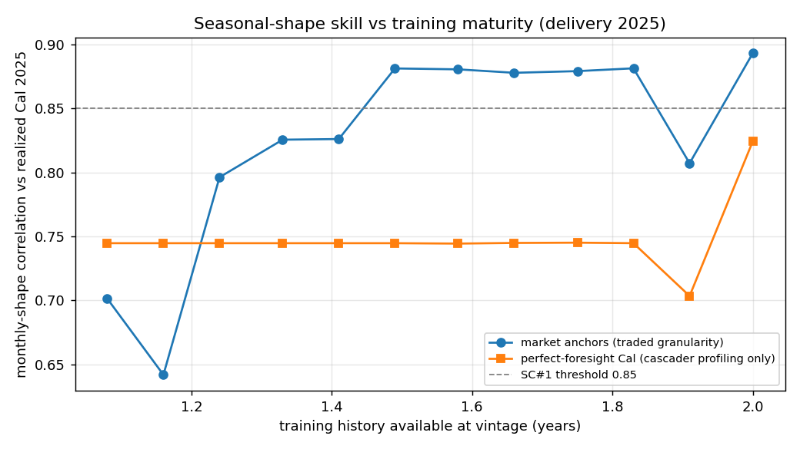
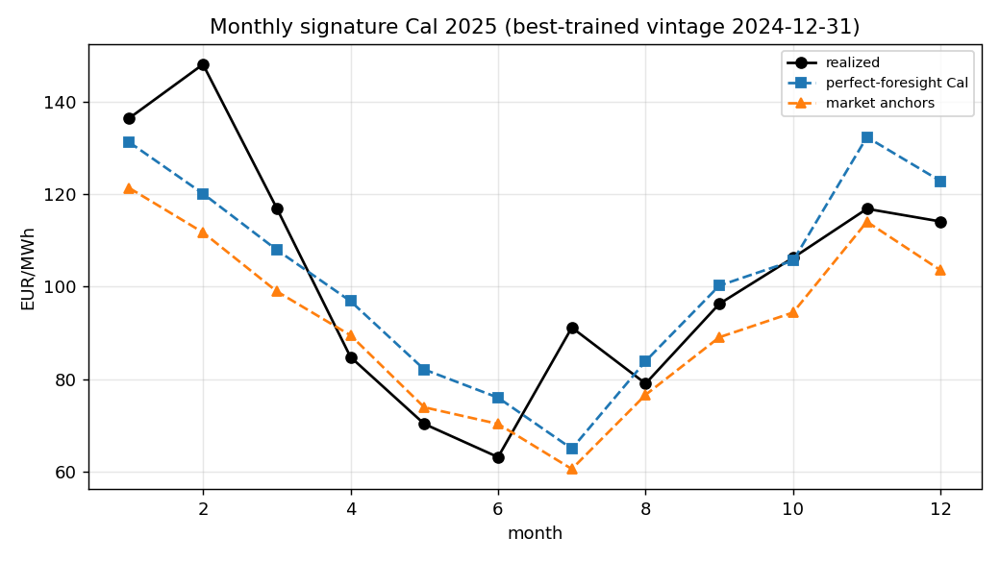
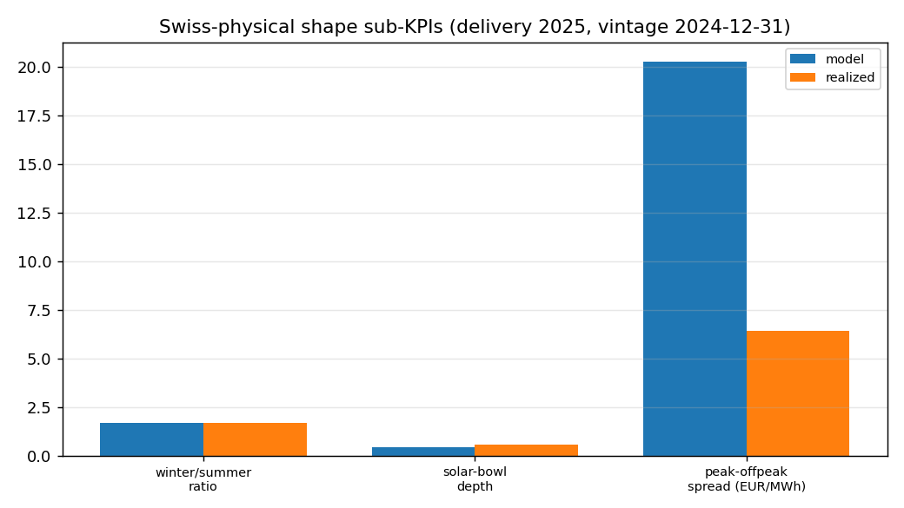
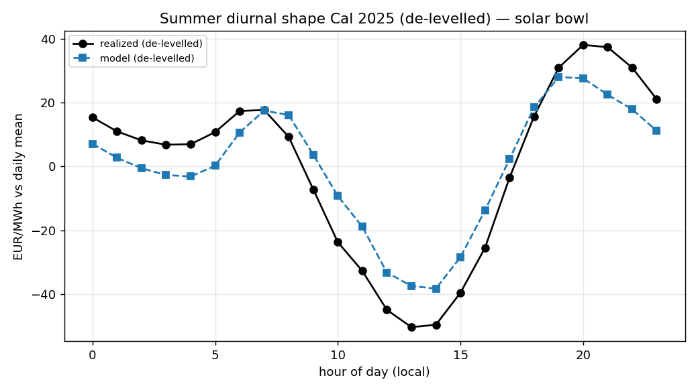
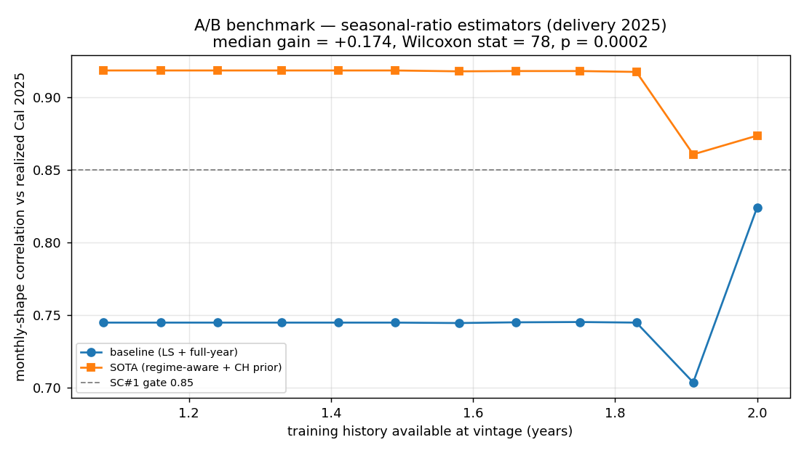

# Perfect-Foresight Shaping Diagnostic — Delivery Cal 2025

**Config** : `bowl_on_floors_off` · **Generated** : 2026-05-30T13:21:47Z

Additive, non-gating. Isolates **shaping** quality from **forward-forecast** error by re-anchoring on realized ex-post settlements (perfect foresight) and de-levelling intra-period profiles. Methodology: Fleten-Lemming (2003), Benth et al. (2007), Kiesel et al. (2019), Lago et al. (2021); CH-physical decomposition after Bevilacqua et al. (2022).

## 1. Granularity ladder (best-trained vintage)

Monthly-shape correlation vs realized, as the anchor granularity coarsens from the full market quotes down to a single realized annual level. The anchor key sets are listed alongside so the comparison is transparent — note in particular that at late-vintage delivery the market may already quote at month granularity for the near horizon, so `market` is not always at coarser granularity than `pf_cal_quarter`.

| anchor | monthly_corr | n_keys | keys |
|---|---|---|---|
| pf_cal | 0.8241 | 1 | 2025 |
| pf_cal_quarter | 0.9275 | 5 | 2025, 2025-Q1, 2025-Q2, 2025-Q3, 2025-Q4 |
| market | 0.8929 | 11 | 2025-01, 2025-02, 2025-03, 2025-04, 2025-Q2, 2025-Q3, 2025-Q4, 2026, 2026-Q1, 2027, 2028 |

## 2. Training-maturity sweep (seasonal-shape decomposition)

`pf_cal_corr` = monthly-shape correlation under **perfect annual-level foresight**. `market_corr` = with real traded quotes. `shaping_residual` = 1 − pf_cal_corr. **Important caveat**: `fit_seasonal_ratios` only counts full calendar years, so many adjacent vintages share identical seasonal_ratios → the sweep's effective sample size is **6 distinct seasonal-ratio regimes**, not the row count. The median/p10/p90 aggregates below should be read with that collapse in mind.

| vintage | train_years | market_corr | pf_cal_corr | pf_cal_spearman | forecast_gap | shaping_residual | n_months |
|---|---|---|---|---|---|---|---|
| 2024-01-31 | 1.08 | 0.7014 | 0.7447 | 0.6364 | 0.0432 | 0.2553 | 12 |
| 2024-02-29 | 1.16 | 0.642 | 0.7447 | 0.6364 | 0.1026 | 0.2553 | 12 |
| 2024-03-29 | 1.24 | 0.7962 | 0.7447 | 0.6364 | -0.0516 | 0.2553 | 12 |
| 2024-04-30 | 1.33 | 0.8255 | 0.7447 | 0.6364 | -0.0808 | 0.2553 | 12 |
| 2024-05-31 | 1.41 | 0.826 | 0.7447 | 0.6364 | -0.0813 | 0.2553 | 12 |
| 2024-06-28 | 1.49 | 0.8811 | 0.7447 | 0.6364 | -0.1364 | 0.2553 | 12 |
| 2024-07-31 | 1.58 | 0.8804 | 0.7444 | 0.6364 | -0.1359 | 0.2556 | 12 |
| 2024-08-30 | 1.66 | 0.8777 | 0.7449 | 0.6364 | -0.1327 | 0.2551 | 12 |
| 2024-09-30 | 1.75 | 0.879 | 0.7451 | 0.6364 | -0.1339 | 0.2549 | 12 |
| 2024-10-31 | 1.83 | 0.8812 | 0.7447 | 0.6364 | -0.1364 | 0.2553 | 12 |
| 2024-11-29 | 1.91 | 0.8071 | 0.7035 | 0.7762 | -0.1036 | 0.2965 | 12 |
| 2024-12-31 | 2.0 | 0.8929 | 0.8241 | 0.8392 | -0.0688 | 0.1759 | 12 |

**Aggregates** — pf_cal_corr median **0.745** [min 0.704, max 0.824]; market_corr median **0.852** (distinct seasonal-ratio regimes: 6).

## 3. De-levelled intra-day shape (cosine + demeaned RMSE)

Computed on the **delivery-year window only** (year == 2025), so the score is not contaminated by extrapolated hours outside the anchored window. Cosine = pattern fidelity (additive- AND multiplicative-invariant on the profile); demeaned RMSE = amplitude fidelity (additive-invariant only — responds to multiplicative rescale by design, since amplitude should).

| vintage | train_years | diurnal_cosine | diurnal_demeaned_rmse | summer_cosine | summer_demeaned_rmse |
|---|---|---|---|---|---|
| 2024-01-31 | 1.08 | 0.7803 | 11.452 | 0.8424 | 17.591 |
| 2024-02-29 | 1.16 | 0.794 | 11.187 | 0.8431 | 17.532 |
| 2024-03-29 | 1.24 | 0.819 | 10.638 | 0.8435 | 17.484 |
| 2024-04-30 | 1.33 | 0.876 | 9.063 | 0.8439 | 17.433 |
| 2024-05-31 | 1.41 | 0.9055 | 8.117 | 0.8444 | 17.381 |
| 2024-06-28 | 1.49 | 0.9341 | 7.19 | 0.9351 | 14.024 |
| 2024-07-31 | 1.58 | 0.9504 | 6.238 | 0.9705 | 9.869 |
| 2024-08-30 | 1.66 | 0.9556 | 5.672 | 0.976 | 7.313 |
| 2024-09-30 | 1.75 | 0.9457 | 5.934 | 0.9601 | 8.783 |
| 2024-10-31 | 1.83 | 0.9368 | 6.256 | 0.9609 | 8.732 |
| 2024-11-29 | 1.91 | 0.9414 | 6.056 | 0.9686 | 9.416 |
| 2024-12-31 | 2.0 | 0.9252 | 6.808 | 0.9597 | 10.15 |

## 4. Swiss-physical sub-KPIs (model vs realized)

Best-trained vintage `2024-12-31`.

| sub-KPI | model | realized |
|---|---|---|
| winter/summer ratio | 1.667 | 1.699 |
| solar-bowl depth | 0.417 | 0.558 |
| peak/off-peak spread (EUR/MWh) | 20.259 | 6.407 |

## 5. Figures

## 6. SOTA A/B benchmark — seasonal-ratios estimator

Paired comparison of baseline (`LS` over full calendar years, in-tree `ContractCascader.fit_seasonal_ratios`) vs SOTA (regime-aware weighted mean + Bayesian shrinkage to CH-physical prior, `RegimeAwareSeasonalRatios`). Wilcoxon signed-rank (one-sided, H1: SOTA > baseline).

| vintage | train_years | baseline | sota | gain |
|---|---|---|---|---|
| 2024-01-31 | 1.08 | 0.7447 | 0.9184 | 0.1737 |
| 2024-02-29 | 1.16 | 0.7447 | 0.9184 | 0.1737 |
| 2024-03-29 | 1.24 | 0.7447 | 0.9184 | 0.1737 |
| 2024-04-30 | 1.33 | 0.7447 | 0.9184 | 0.1737 |
| 2024-05-31 | 1.41 | 0.7447 | 0.9184 | 0.1737 |
| 2024-06-28 | 1.49 | 0.7447 | 0.9184 | 0.1737 |
| 2024-07-31 | 1.58 | 0.7444 | 0.9178 | 0.1734 |
| 2024-08-30 | 1.66 | 0.7449 | 0.918 | 0.1731 |
| 2024-09-30 | 1.75 | 0.7451 | 0.918 | 0.1729 |
| 2024-10-31 | 1.83 | 0.7447 | 0.9174 | 0.1727 |
| 2024-11-29 | 1.91 | 0.7035 | 0.8606 | 0.1571 |
| 2024-12-31 | 2.0 | 0.8241 | 0.8735 | 0.0494 |

**Median**: baseline `0.7447` → SOTA `0.9182` (+0.1735). **Vintages improved**: 12/12. **Wilcoxon**: stat=78, p=0.0002.

